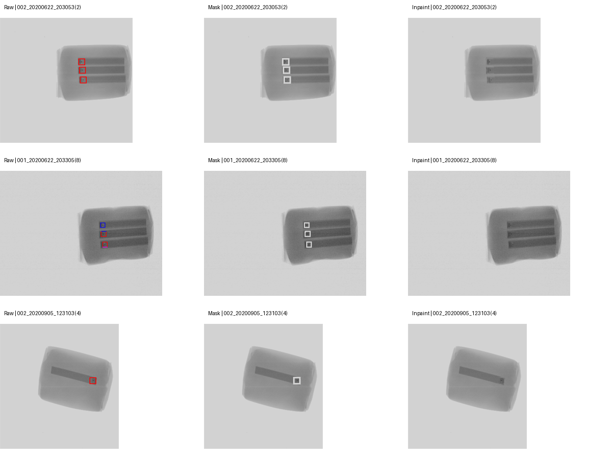
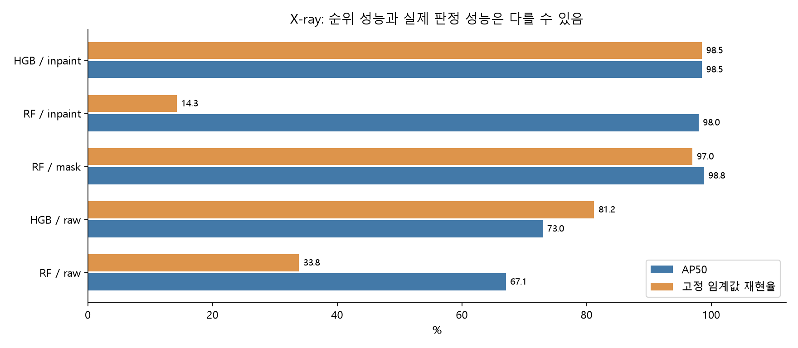
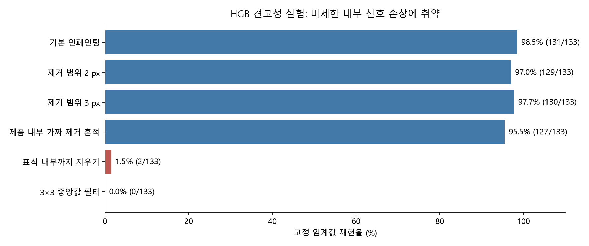

# ④ X-ray 영상 기반 완제품 이물질 탐지 및 AI 미탐지 조건 분석

## 데이터 검증·기준 실험 보고서

주제: ④로 최종 확정 · 최초 실험: 2026-09-28 · 문서·패키지 업데이트 및 전 과정 재검증: 2026-10-02

## 1. 주제 확정 후의 핵심 판단

**본 과제는 색상 표식에 의존하지 않는 소형 이물 탐지와, 모델이 놓치는 조건을 정량적으로 설명하는 것을 목표로 한다.** 이번 보고서는 X-ray 데이터의 구조, 라벨 신뢰성, 표식 누수, 전처리, 탐지 기준모델, 실패조건 및 후속 개발 계획만 다룬다.

주요 TXT와 연결된 고유 영상은 **500장·1,147개 객체**다. 날짜를 분리한 후반 평가에서 인페인팅+HGB 기준모델은 **133개 중 131개를 탐지**했다. 다만 이 수치를 전체 데이터나 실제 생산현장의 성능으로 확대할 수 없다. 별도 날짜의 표식 중첩 객체에서는 박스 크기 예측 문제가 드러났고, 정상 제품의 오경보율은 아직 측정할 수 없다.

| 검증된 사실 | 개발상 의미 |
|---|---|
| 표식만으로도 후반 객체의 96.99%를 탐지 | 높은 원본 점수만으로 실제 이물 학습을 입증할 수 없음 |
| 인페인팅 후 HGB 재현율 98.50% | 표시 제거 후에도 학습 가능한 내부 신호가 존재 |
| RF는 AP50 97.96%지만 고정 임계값 재현율 14.29% | 탐지 순위와 운영 판정을 분리해 검증해야 함 |
| 표식 중첩군 IoU 기준 재현율 37.88%, 중심 포함은 66/66 | 고정 10×10 후보 박스를 가변 크기 박스로 개선할 근거 |
| 3×3 중앙값 필터 후 HGB 재현율 0% | 작은 내부 신호를 지우는 전처리에 매우 취약 |
| 주요 500장 모두 양성·표식 포함 | 정상 제품 오경보와 무표식 원본 일반화는 미검증 |

**현 단계의 개발 우선순위는 가변 크기 박스 예측, 어려운 조건을 포함한 평가 구성, 표식 제거 흔적 검증, 판정 임계값 안정성이다.** 이미 수행한 실험 결과와 앞으로 수행할 개발 제안을 아래에서 구분한다. 기존 평가 영상을 새롭게 미접촉 테스트라고 취급하지 않는다.

## 2. 공식 과제와 분석 범위

첨부 공식 PDF 2페이지의 ④는 제품 내부 이물의 위치 탐지, 이물 조건에 따른 성능 차이 분석, 안전을 고려한 판정 임계값과 재검사 기준을 요구한다. 4페이지의 평가표는 데이터 이해·진단 15점, 모델 40점, 영향요인·오류분석 15점, 현장 활용 10점, 창의성 10점, 재현성 10점이며 두 개 이상의 모델 비교를 요구한다.

첨부 PDF 자체에는 기존 MD가 인용한 ‘외부 데이터 허용’과 ‘색상 사각형 제거·TXT 우선’ 추가 안내가 없다. 해당 내용은 제공된 분석 문서의 주장으로 구분한다. 이번 실험은 주요 TXT를 정답으로 고정하고 표식 자체의 탐지는 누수 진단용으로만 평가했다. 외부 학습 데이터와 배포된 PT 가중치는 사용하지 않았다. 규정의 최신 변경 여부를 이번 문서 개정에서 별도로 확인한 것은 아니다.

| 공식 요구 | 현재 확보한 근거 | 다음 단계에서 보완할 부분 |
|---|---|---|
| 이물 위치 탐지 | 전체 영상 후보 생성+RF/HGB, IoU 일대일 평가 | 가변 크기 박스, 엄격한 위치 정확도 |
| 조건별 미탐지 분석 | 대비·크기·표식 중첩·시간·전처리 변화 실험 | 제품 경계, 신규 실물·제품, 다양한 재질 |
| 안전 임계값·재검사 기준 | 검증 임계값의 시간 변화 실패 확인 | 정상 영상 및 목표 재현율 기반 정책 검증 |
| 재현성 | 고정 분할·seed·결과·환경·소스 해시 | 최종 모델·제출 형식의 별도 재현 검증 |

## 3. 데이터 구조와 정답 검증

### X1. 파일 수, 중복, 라벨 충돌

**질문:** 실제로 몇 장을 학습·평가할 수 있으며, 폴더를 합칠 때 누수가 생기는가?

**방법:** 전체 파일 목록, 원본 RGB 픽셀 SHA-256, 파일명 stem, TXT 좌표 유효성, XML 객체 수를 전수 확인했다.

| 항목 | 실측 결과 |
|---|---:|
| 전체 BMP | 2,824개 |
| `NgImage` 폴더 BMP | 2,809개 |
| 이 원본의 고유 RGB 픽셀 영상 | 2,532개, 중복 초과 277개 |
| 원본의 고유 파일명 stem | 2,529개. 3개 stem은 내용이 다른 두 영상 존재 |
| ‘라벨링 6종 세트’ JPG | 1,065개이지만 고유 stem은 400개 |
| 주요 `labels` TXT | 500개, 원본과 전부 연결 |
| 주 분석 집합 | 고유 픽셀 영상 500장, 객체 1,147개, 클래스 0 한 종류 |
| 주 분석 TXT 좌표 오류·빈 라벨 | 0개 / 0개 |
| 주 분석 영상의 정상·음성 정답 | 0장 |
| 탐지용 TXT 전체 | 물리 파일 530개, 고유 stem 512개 |
| TXT 버전 충돌 | 주 labels와 실습용 두 폴더 사이에 3개 stem의 박스 불일치 |
| XML | 833개 중 객체 없는 파일 810개 |
| 빈 XML과 양성 TXT의 충돌 | 14개 stem |

실습용 15·50·100·200·300·400장 폴더를 독립 데이터로 합치면 같은 영상이 여러 번 들어간다. JPG 400장밖에 없어도 BMP와 연결하면 주요 TXT 500개를 모두 사용할 수 있다. 반대로 TXT가 없는 BMP나 빈 XML을 정상 영상으로 해석하면 안 된다. 실제로 빈 XML과 양성 TXT가 충돌한다.

실험은 버전이 가장 큰 주요 `labels` 500개를 기준으로 고정했다. 이는 재현을 위한 **분석상 선택**이지, 주최 측이 해당 TXT 버전을 우선한다고 확인해 준 것은 아니다. 추가 12개 stem은 본 성능 비교에 포함하지 않았다. 충돌 3개 stem의 정확한 목록은 결과 JSON에 남겼다.

폴더에는 1·2·3호기가 있지만 동일 픽셀·동일 파일명이 폴더를 넘나든다. 파일명 접두사 001·002도 장비 식별자로 확정할 수 없어, 장비별 독립 일반화 성능으로 표현하지 않았다.

### X2. 색상 표식이 얼마나 강한 정답 힌트인가?

**방법:** BMP의 픽셀에서 `max(R,G,B)-min(R,G,B)>40`을 색상 픽셀로 검출했다. 연결요소의 사각형과 TXT 박스를 비교했다. 표식만 찾는 진단용 탐지기의 박스 축소 비율은 학습셋에서만 선택했다.

| 검증 항목 | 결과 |
|---|---:|
| 표식이 있는 원본 BMP | 2,809 / 2,809 |
| 표식이 있는 주요 라벨 영상 | 500 / 500 |
| TXT 객체 중심이 표식 외접 사각형 안에 있음 | 1,145 / 1,147 = 99.83% |
| TXT 박스 내부에 색상 픽셀이 직접 존재 | 132 / 1,147 = 11.51% |
| 1픽셀 팽창 후 TXT 내부에 제거 영역이 존재 | 364 / 1,147 = 31.73% |
| 팽창 제거 영역이 TXT 면적의 25% 초과 | 38개 객체 |
| 색상 표식만으로 후반 테스트 탐지 | TP 129, FP 4, FN 4. 정밀도·재현율 각 96.99% |

**해석:** 색상 표식과 TXT 박스의 평균 IoU는 약 0.33으로 낮아 보여도, 중심은 거의 전부 일치한다. 즉 ‘박스 IoU가 낮으므로 누수가 작다’는 해석은 잘못이다. 이물의 영상 특징을 전혀 학습하지 않고도 97% 가까이 찾을 수 있다.

표식만 탐지한 점수는 사용할 수 있는 제출 모델의 성능이 아니라, 누수가 얼마나 쉬운지를 보여주는 진단 결과다. 표식 없는 실제 원본으로 평가할 수 있는 주 분석 영상은 0장이다.

## 4. 탐지·누수·견고성 실험

### 실험 설계

이 실험은 확정된 X-ray 주제의 개발 출발점으로서 신호·누수·평가 가능성을 확인한 기준 실험이다. YOLO의 최종 최고 성능을 추정하는 실험은 아니다.

**날짜 분할**은 파일명의 날짜를 기준으로 만들었다. 같은 날짜는 하나의 집합에만 포함했다. 고유 영상 500장을 먼저 선정했으므로 픽셀 동일 영상이 분할을 넘는 경우도 없다. 다만 동일한 실물 시험편이 여러 날짜에 다시 촬영됐는지 확인할 식별자는 없다.

| 집합 | 날짜 범위와 포함 일수 | 이미지 | 객체 |
|---|---|---:|---:|
| 학습 | 06-22~06-29, 포함 5일 | 294 | 881 |
| 검증·임계값 선택 | 07-14~08-18, 포함 9일 | 73 | 133 |
| 후반 평가 | 08-19~09-22, 포함 10일 | 133 | 133 |

**두 탐지 기준모델:** 영상 전체에서 11×11 black-hat 연산과 5×5 국소 최대점을 사용해 어두운 점 후보를 만든 뒤, 각 후보의 17×17 패치를 85개 특징으로 표현했다. 후보 박스는 10×10 픽셀로 고정했다. Random Forest(RF)와 Histogram Gradient Boosting(HGB)가 후보를 분류한다. 파일명·날짜·위치 좌표·색상 마스크를 분류 특징에 넣지 않았다. 후보 생성도 정답 박스를 참조하지 않는다. 학습 때만 후보와 정답의 IoU로 양성·음성을 지정했다.

- RF: 트리 100개, 최대 깊이 16, 최소 잎 표본 3, 클래스 가중치.
- HGB: 반복 100회, 최대 잎 15개, L2=1.
- 후보 최대 800개, NMS IoU 0.2, 영상당 출력 최대 30개.
- 기본 seed 42. 반복 실험 seed 84·2026.
- 각 모델의 임계값은 검증셋에서 0.05~0.95를 0.05 간격으로 비교해 F1 최대값으로 고정. 동률은 낮은 임계값 선택.
- TP는 IoU≥0.5에서 정답과 예측의 일대일 대응. AP50은 PR 곡선 단조 보간의 면적으로 직접 계산했다. COCO 공식 구현의 101점 AP와 동일하다고 주장하지 않는다.

**세 영상본:** Raw는 원본의 그레이스케일, Mask는 색상 검출 영역을 1픽셀 팽창한 뒤 영상 중앙값으로 덮은 영상, Inpaint는 같은 마스크를 Telea 반경 3으로 복원한 영상이다. 그레이스케일만으로는 색상 사각형이 제거되지 않는다.

### X3. 원본·마스킹·인페인팅 비교

| 학습·평가 영상 | 모델 | AP50 | 고정 임계값 | 정밀도 | 재현율 | F1 | TP / FP / FN |
|---|---|---:|---:|---:|---:|---:|---|
| Raw → Raw | RF | 67.06% | 0.25 | 100.00% | 33.83% | 50.56% | 45 / 0 / 88 |
| Raw → Raw | HGB | 72.99% | 0.10 | 75.52% | 81.20% | 78.26% | 108 / 35 / 25 |
| Mask → Mask | RF | 98.83% | 0.55 | 95.56% | 96.99% | 96.27% | 129 / 6 / 4 |
| Inpaint → Inpaint | RF | 97.96% | 0.45 | 100.00% | 14.29% | 25.00% | 19 / 0 / 114 |
| Inpaint → Inpaint | HGB | 98.50% | 0.05 | 100.00% | 98.50% | 99.24% | 131 / 0 / 2 |

**인사이트 1 — 표식을 지워도 학습 가능한 신호가 남는다.** HGB의 Inpaint 결과는 색상 표시가 없어도 이 데이터의 내부 신호를 탐지할 수 있다는 개발 가능성을 보여준다. 다만 인페인팅 흔적까지 완전히 배제했다는 증명은 아니다.

**인사이트 2 — 단순 마스킹의 높은 점수를 그대로 믿으면 안 된다.** 중앙값으로 덮은 사각형은 새로운 시각적 힌트가 될 수 있다. 이번 실험은 Mask 모델의 흔적 독립성을 확정하지 않았으므로 최종 채택 근거로 삼지 않는다.

**인사이트 3 — AP와 운영 임계값 성능은 다르다.** RF Inpaint의 AP는 97.96%인데 고정 임계값 재현율은 14.29%다. 검증 F1 98.50%를 주던 임계값이 후반 날짜에 이식되지 않았다. 학습셋은 영상당 약 3개, 후반 평가셋은 전부 1개 객체이며 영상 조건도 달라진다. 확률·점수 분포 이동을 고려해야 한다. 테스트에서 임계값을 다시 조정해 좋은 점수로 바꾸지 않았다.

### X4. 표식과 제거 흔적에 의존하는가?

**원본 학습 모델에 표식 제거·이동 적용:** HGB Raw 모델은 Raw 평가 재현율 81.20%에서 Inpaint 평가 54.89%, 원래 표식을 제거하고 다른 위치에 사각형을 만든 평가 37.59%로 떨어졌다. 이는 원본 표식에 대한 민감성을 보여준다. 동시에 영상 분포 변화도 포함되므로 순수한 인과적 표식 의존량이라고 해석하지 않는다.

**Inpaint HGB의 후처리 교란:** 모든 실험에서 같은 모델과 임계값 0.05를 유지했다.

| 평가 영상 변경 | AP50 | TP / FP / FN | 재현율 | 해석 |
|---|---:|---|---:|---|
| 기본 1픽셀 팽창 Inpaint | 98.50% | 131 / 0 / 2 | 98.50% | 기준 |
| 제거 영역을 2픽셀 팽창 | 96.43% | 129 / 1 / 4 | 96.99% | 소폭 저하 |
| 제거 영역을 3픽셀 팽창 | 98.41% | 130 / 0 / 3 | 97.74% | 이 후반 표본에서는 비교적 유지 |
| 영상 전체의 임의 위치에 제거 흔적 3개 | 97.74% | 130 / 1 / 3 | 97.74% | 간단한 흔적 교란에 크게 흔들리지 않음 |
| 어두운 제품 내부에 제거 흔적 3개 | 95.08% | 127 / 1 / 6 | 95.49% | 더 어려운 교란에서 일부 저하 |
| 표식 사각형 내부 신호까지 전부 인페인팅 | 0.52% | 2 / 25 / 131 | 1.50% | 내부 정보를 지우면 대부분 실패 |
| 기본 Inpaint 후 3×3 중앙값 필터 | 0.51% | 0 / 1 / 133 | 0.00% | 미세한 점 신호 손상에 매우 취약 |

제품 내부 가짜 제거 흔적은 실제 정답 박스 15개와 우연히 겹쳤다. 따라서 그 실험의 저하에는 흔적에 대한 반응뿐 아니라 실제 신호 손상도 포함된다. 내부 전체 제거는 정답이 가리키는 시각 정보를 의도적으로 훼손한 진단 실험이다. 이때의 FN을 현장 오차율로 해석하지 않는다.

**종합:** 단순 색상 선만 보고 답하는 모델을 벗어날 가능성은 확인했다. 내부 미세 신호를 보존하는 전처리가 필수다. ‘노이즈 제거’라는 이유로 중앙값 필터를 적용하는 것은 이 데이터에서 매우 위험했다. 그러나 표식 없는 원본이 없으므로 실제 이물 신호와 복원 흔적의 기여를 완벽하게 분리할 수는 없다.

### X5. 반복 학습과 후반 평가의 오류 조건

HGB Inpaint의 seed 42·84·2026 결과는 다음과 같다. 각 seed의 임계값은 각각의 검증셋에서 선택했다.

| seed | 검증 선택 임계값 | AP50 | 재현율 | F1 |
|---:|---:|---:|---:|---:|
| 42 | 0.05 | 98.50% | 98.50% | 99.24% |
| 84 | 0.10 | 99.25% | 99.25% | 99.62% |
| 2026 | 0.15 | 98.03% | 96.24% | 97.71% |
| 평균 ± 표본 표준편차 | — | 98.59 ± 0.61%p | 97.99 ± 1.57%p | 98.86 ± 1.01%p |

이는 **동일 분할에서의 초기화 민감도**다. 날짜·제품 다양성에 대한 신뢰구간이 아니다. 기본 seed의 재현율을 10개 평가 날짜 단위로 10,000번 재표집한 탐색적 95% 구간은 96~100%였지만, 날짜가 10개뿐이고 같은 시험편의 반복 촬영 여부도 불명확하다.

기본 seed의 오류 두 건은 아래와 같다. 저대비 기준은 학습셋의 하위 25%인 ‘TXT 박스 내 인페인팅 밝기 중앙값−최솟값 ≤38’로 정했다. 물리적 밀도 측정값이 아니라 영상 대비의 대용값이다.

| 후반 평가 조건 | 객체 수 | 탐지 / 미탐지 | 재현율 |
|---|---:|---|---:|
| 저대비 | 53 | 51 / 2 | 96.23% |
| 그 외 대비 | 80 | 80 / 0 | 100.00% |
| 작은 박스: 면적 ≤88 px² | 29 | 29 / 0 | 100.00% |
| 그 외 크기 | 104 | 102 / 2 | 98.08% |

미탐지 파일은 `002_20200904_230054(2)`, `002_20200905_043156(0)`이며 대비값은 30·35다. 이 작은 표본에서 ‘작은 이물일수록 반드시 어렵다’는 가설은 지지되지 않았다. 저대비 실패는 관찰됐지만 두 사례만으로 원인을 확정하지 않는다.

후반 평가에는 색상 픽셀이 TXT 박스 안을 침범하는 객체가 **0개**다. 따라서 위 98.50%를 그런 객체까지 대표하는 결과로 사용하면 안 된다.

### X6. 표식 중첩 사례를 별도로 평가하면?

**질문:** 후반 평가가 다루지 못한, 표식과 정답 박스가 겹치는 경우에도 가능한가?

**방법:** 6월 24일을 별도 평가셋(104장·312개 객체), 6월 23일을 검증셋(108장), 나머지를 학습셋(288장)으로 사용했다. 동일 HGB 설정으로 학습하고 검증에서 고른 임계값 0.95를 고정했다. 이 실험은 **일자 그룹 내삽 평가**이며 미래 날짜 예측 성능과 별개다. 앞의 날짜 분할 결과와 평균하지 않는다.

| 6월 24일 조건 | 객체 수 | IoU≥0.5 탐지 | 재현율 | 정답 안에 예측 중심이 존재 | 후보 생성 단계에서 IoU≥0.5 가능 |
|---|---:|---:|---:|---:|---:|
| 표식 픽셀 비중첩 | 246 | 234 | 95.12% | 246 / 246 | 234 / 246 |
| 표식 픽셀 중첩 | 66 | 25 | 37.88% | 66 / 66 | 26 / 66 |

전체 AP50은 71.04%, 재현율 83.01%, F1 82.75%였다. 중첩군 박스 면적 중앙값은 206 px², 비중첩군은 106 px²다.

**핵심 해석:** 중첩군 성능 저하를 모두 ‘인페인팅이 이물을 지웠기 때문’이라고 설명하면 틀린다. 중심은 66개 모두 찾았고, 고정 10×10 박스의 후보 생성 단계부터 40개가 IoU≥0.5를 만족하지 못했다. 중심에 정확히 놓인 100 px² 예측 박스도 정답이 206 px²라면 최대 IoU는 약 0.485다. 이 실험에서 주된 병목은 박스 크기·위치 표현이며, 가변 크기 박스 회귀가 필요하다.

중심 포함률은 원인 진단용 지표다. 공식 탐지 성능을 대신하는 느슨한 지표로 바꿔 점수를 주장하지 않는다. 후반 평가에서도 AP75는 31.97%, 동일 방식의 IoU 0.50~0.95 평균 AP는 44.74%에 그쳤다. AP50이 높더라도 정밀한 박스 검출은 아직 부족하다.

## 5. 성능 해석의 범위

**확인된 것:** 주요 500장과 TXT의 연결, 표식 누수의 강도, 표식 제거 후 탐지 가능성, 임계값 이동, 표식 중첩군의 박스 크기 병목, 미세 신호 손상 취약성이다.

**미확인 사항:** 표식 없는 실제 원본 성능, 정상 제품 오경보율, 신규 실물·신규 제품 일반화, 현장 안전 임계값이다. 높은 기준 실험 점수를 이 네 가지의 증명으로 사용하지 않는다.

영상에는 막대형 구조와 점 형태의 이물이 반복된다. 표준 시험편 반복 촬영 가능성을 시사하지만 메타데이터로 확정하지 않았다. 실물 식별자가 없으므로 날짜 분리만으로 촬영 대상의 독립성까지 보장할 수 없다. 재질·물리 밀도 정보와 신뢰할 제품 경계 라벨도 없어 해당 조건별 성능을 검증했다고 표현하지 않는다.

주요 평가 영상은 모두 양성이다. 따라서 **FP=0은 양성 영상에서 TXT와 맞지 않는 추가 박스가 0개라는 의미**이며 정상 제품 오경보율 0%가 아니다. 미표기 객체의 존재 여부도 완전히 확인되지 않아 FP는 TXT 기준으로 해석한다. 정상 영상 없이 재검률·운영 비용·자동 통과의 안전성을 확정할 수 없다.

현재 결과는 개발 방향 설정을 위한 탐색 실험이다. 기준모델·교란·보완 실험에서 평가 결과를 이미 확인했으므로 해당 데이터를 최종 제출의 미접촉 테스트로 다시 포장하지 않는다. 새로운 평가 자료가 없으면 반복 일자 그룹 평가와 불확실성 보고로 증거의 한계를 명시해야 한다.

## 6. 확정 주제의 후속 개발 계획

공식 주제를 유지하며 연구의 초점을 **‘표식 누수를 통제한 소형 이물 탐지와 전처리·위치 오차·임계값 변화에 따른 미탐지 분석’**으로 구체화한다. 아래는 실험 완료 사실이 아닌 후속 계획이다.

| 우선순위 | 작업 | 근거와 완료 기준 |
|---|---|---|
| 1 | TXT 버전과 평가 단위 확정 | 충돌 3개 stem의 공식 우선순위를 확인하고 이미지·정답·분할 manifest를 고정 |
| 2 | 가변 크기 탐지기 두 종류 비교 | 고정 10×10 한계를 해소하고 동일 분할의 AP50·AP75·중첩군 오류로 평가 |
| 3 | 전처리와 흔적 의존성 검증 | 제거 폭, 마스킹, 인페인팅, 제품 내부 가짜 흔적을 동일 기준으로 비교 |
| 4 | 어려운 조건의 평가 보강 | 중첩·저대비·큰 정답 박스·시간 변화별 표본 수와 오류를 함께 제시 |
| 5 | 재검사 정책 검증 | 정상 정답과 목표 재현율을 확보한 뒤 검증셋에서 임계값을 정하고 별도 평가 |

작은 원본 신호 보존을 우선한다. 해상도 확대·타일링은 실험할 후보이며 무조건적인 개선으로 전제하지 않는다. 중앙값 필터처럼 점 신호를 제거할 수 있는 처리는 기본값으로 사용하지 않는다.

정상 라벨과 무표식 평가 자료가 확보되기 전에는 자동 통과의 안전성을 주장하지 않는다. confidence가 낮거나 전처리 방법에 따라 결과가 달라지는 입력, 학습 분포와 다른 입력은 재검사 대상으로 설계하되 실제 재검 부담은 정상 영상에서 별도로 측정해야 한다. confidence를 보정된 불량확률로 바로 해석하지 않는다.

주최 측 확인 사항은 **TXT 충돌 버전 우선순위, MD에 인용된 추가 규정의 공식 원문, 정상·무표식 평가 자료 제공 여부**다. 문의 메시지는 전송하지 않았다.

## 7. X-ray 전용 재현 패키지

패키지는 X-ray 데이터 폴더 하나만 입력받는다. 감사, 라벨 검증, 날짜 분할, 기준모델, 교란·seed 반복, 보완 날짜 평가, 결과 요약을 순서대로 실행한다. XML 감사와 TXT 해시 생성도 실행 흐름에 포함했다. 원본 데이터는 읽기만 한다.

| 패키지 구성 | 내용 |
|---|---|
| `reproduce.py` | 전체 실행 진입점. `--data-root`에 X-ray 폴더 자체를 지정 |
| `work/*.py` | X-ray 전용 감사·실험·검증 코드 |
| `evidence/` | 실행 당시 결과·분할·환경·로그·해시 스냅샷 |
| `requirements.txt` | X-ray 실행에 필요한 패키지와 버전 |
| `reports/` | 본 보고서와 시각화 |

큰 BMP 원본과 배포된 PT 가중치는 포함하지 않는다. 패키지의 소스 파일 해시는 탐지용 TXT 530개에 한정하며, BMP의 RGB 픽셀 해시는 `xray_inventory.csv`에 별도로 있다. 공식 PDF와 기존 분석 문서의 원문은 패키지에 중복 포함하지 않는다. `evidence/`의 절대 경로는 당시 출처 기록이며, 재실행하면 지정한 `--data-root`로 `work/`의 경로와 결과를 다시 생성한다.

실행 예시는 패키지 README에 수록했다. 재실행은 수치 결과와 그림을 생성하며 서술 보고서를 자동으로 다시 쓰지는 않는다. **2026-10-02 재검증 결과:** X-ray 폴더만 입력받아 9개 단계를 전부 재실행했고 모두 성공했다. 분할·주요 실험·교란·보완 평가·요약 등 9개 결과 JSON이 이전 기준 결과와 허용오차 내 일치했다. 모델이나 임계값을 새로 튜닝한 결과가 아니라 코드 분리 후 기존 결과의 재현 확인이다.

재검증 상태와 변경 사항은 패키지 `RELEASE_NOTES.md`, 단계별 종료코드는 `evidence/run_status.json`에서 확인할 수 있다.

| 보고서 근거 | 결과 파일 |
|---|---|
| 파일 전수·고유 객체 | `audit_summary.json`, `xray_unique_summary.json`, `xray_inventory.csv` |
| 빈 XML의 위험 | `xml_audit.json` |
| TXT 출처 해시 | `source_file_manifest.json` |
| 고정 분할·기준모델 | `split.json`, `xray_results.json`, `xray_predictions.json` |
| 교란·반복 학습 | `robustness_results.json`, `robustness_hgb_results.json` |
| 후반 오류·위치 정확도 | `final_summary.json`, `hgb_test_objects.csv` |
| 중첩군 보완 평가 | `overlap_result.json`, `overlap_test_objects.csv` |
| 재현 검증 | `verification.json`, `run_status.json`, `reproduction_comparison.json` |

**개발의 출발점은 확보됐다.** 다음 단계의 성과는 후반 AP50을 더 높이는 것뿐 아니라, 큰 박스·표식 중첩·전처리 변화·판정 임계값에서 드러난 실패를 얼마나 줄이고 정직하게 설명하는지로 판단해야 한다.
