# HWPX 반영목록 — 구판 → 최종본

- 구판: `reports/결과보고서.md`(2026-10-06, 사용자가 HWPX에 옮긴 판) / 최종본: `reports/REPORT_최종.md`
- 이 목록은 두 파일의 줄 단위 diff(머리 주석 줄 제외)에서 자동으로 만들었으며, 모든 변경 줄이 아래 행 하나씩에 대응함
- 표기: `&nbsp;` 들여쓰기와 `\*` 이스케이프는 지우고 보여 줌. `**…**` = 굵게, 〔그림 x-y〕 = 캡션. 표 칸 구분 `|`는 `\|`로 표시
- 관련 ID는 `reports/확인필요_검증결과.md`의 항목 번호. '용어' = 기술 용어 통일(decisions.md 2026-10-06)
- 그림 캡션 행의 '교체'는 그 위치의 그림 파일도 새 파일로 바꿔야 함을 뜻함
- 위치 칸의 글머리 단계가 '(HWPX 반영 불필요)'인 행은 Markdown 미리보기·주석용 변경이라 HWPX에 옮기지 않아도 됨
- 그림 파일은 `outputs/figures_report/`(보고서 그림 16개 최종본)에서 가져옴

## 본문 변경 (169건)

| 번호 | 위치(장 · 절 · 글머리 단계 · 앞 문장 일부) | 수정 전 | 수정 후 | 관련 ID | 그림 교체 |
|---:|---|---|---|---|---|
| 1 | 표지 · — · 주석(HWPX 반영 불필요) · 앞: "[//]: # (작성 규칙: CLAUDE.m…" | [//]: # (글머리 위계: ◦ 1단계(휴먼명조 14) / - 2단계(휴먼명조 14) / * 3단계(휴먼명조 10), 줄간격 160%. 그림은 outputs/figures/의 PNG를 삽입합니다.) | [//]: # (글머리 위계: ◦ 1단계(휴먼명조 14) / - 2단계(휴먼명조 14) / * 3단계(휴먼명조 10), 줄간격 160%. 그림은 outputs/figures_report/의 PNG를 삽입합니다.) | R-11 | — |
| 2 | 표지 · — · 표 · 앞: "\| **팀명** \| {{팀명}} \|…" | \| **내용요약** \| 분말유크림 최종 X-ray 검사에서 장비가 NG로 판정한 영상(고유 2,532장, 라벨 500장·1,147객체)으로 2–4px 이물을 탐지함. 장비 색상 표시가 전 영상에 있고 정답 위치와 99.8% 일치해 표시만으로 F1 0.94가 나오는 누수를 확인함. 이를 팔레트 기반 정확 제거, 후광 처리, 흔적-이물 독립화 학습(가짜 표시·투과율 이식·흔적 음성)으로 차단하고, 8종 지름길 시험으로 검증함. 베이스라인(HGB)과 YOLOv8s 계열 5종을 동일 날짜 그룹 교차검증으로 비교해 YOLOv8s-P3(독립화 학습)을 선정했고, 동결 테스트(100장·178객체, 1회 평가)에서 AP50 0.973, Precision·Recall·F1 0.983을 얻음(베이스라인 F1 0.930). 대비×위치 통제 스트레스로 탐지 한계를 정량화하고, 보정 확률 기반 3구간(통과·재검사·배출)과 불확실성 재검사 규칙을 제안함. 테스트에서 드러난 통과 임계값 이식 실패(3호기 1띠 제품의 점수 척도 하락)를 dev 중첩 시뮬레이션으로 재현하고, 사전 고정 기준으로 여유 규칙과 분포 밖 영상 가드를 채택함 \| | \| **내용요약** \| 분말유크림 최종 X-ray 검사에서 장비가 NG로 판정한 영상(고유 2,532장, 라벨 500장·1,147객체)으로 2–4px 이물을 탐지함. 장비 색상 표시가 전 영상에 있고 정답 위치와 99.8% 일치해 표시만으로 F1 0.94가 나오는 누수를 확인함. 이를 팔레트 기반 정확 제거, 후광 처리, 흔적-이물 탈상관 학습(모조 표시·투과율 이식·흔적 음성 샘플)으로 차단하고, 8종 누수 검증 시험(T1–T8)으로 검증함. 베이스라인(HGB)과 YOLOv8s 계열 5종을 동일 날짜 그룹 교차검증으로 비교해 YOLOv8s-P3(흔적-이물 탈상관 학습)을 선정했고, 동결 테스트(100장·178객체, 1회 평가)에서 AP50 0.973, Precision·Recall·F1 0.983을 얻음(베이스라인 F1 0.930). 대비×위치 통제 스트레스로 탐지 한계를 정량화하고, 보정 확률 기반 3구간(통과·재검사·배출)과 불확실성 재검사 규칙을 제안함. 테스트에서 드러난 통과 임계값 이식 실패(3호기 1띠 제품의 점수 분포 하향 이동)를 dev 중첩 시뮬레이션으로 재현하고, 사전 고정 기준으로 마진 규칙과 분포 외 입력(OOD) 가드를 채택함 \| | #13, R-8, 용어 | — |
| 3 | 제1장 · 데이터가 나타내는 공정 상태 · * 3단계 · 앞: "- 촬영의 90.3%가 0·4·8·12·16…" | * 해석(가설): 4시간 주기 **정기 감도점검(시험편 통과) 세션**일 가능성이 높음. 같은 물리 시험편을 반복 촬영했을 수 있으므로 어떤 분할로도 '새로운 이물'에 대한 일반화는 보장되지 않음을 전제로 분석함 | * 해석(가설): 4시간 주기 **정기 감도점검(시험편 통과) 세션**일 가능성이 높음. 같은 물리 시험편을 반복 촬영했을 수 있으므로 어떤 분할로도 ‘새로운 이물’에 대한 일반화는 보장되지 않음을 전제로 분석함 | 용어 | — |
| 4 | 제1장 · 데이터가 나타내는 공정 상태 · 그림 위치 표시(HWPX 반영 불필요) · 앞: "* 해석(가설): 4시간 주기 **정기 감도…" | > **[그림 삽입 위치]** `outputs/figures/data_time_structure.png` | > **[그림 삽입 위치]** `outputs/figures_report/data_time_structure.png` | R-11 | — |
| 5 | 제1장 · 데이터가 나타내는 공정 상태 · 그림 미리보기 줄(HWPX 반영 불필요) · 앞: "> **[그림 삽입 위치]** `output…" | (없음 — 새 줄 추가) | > 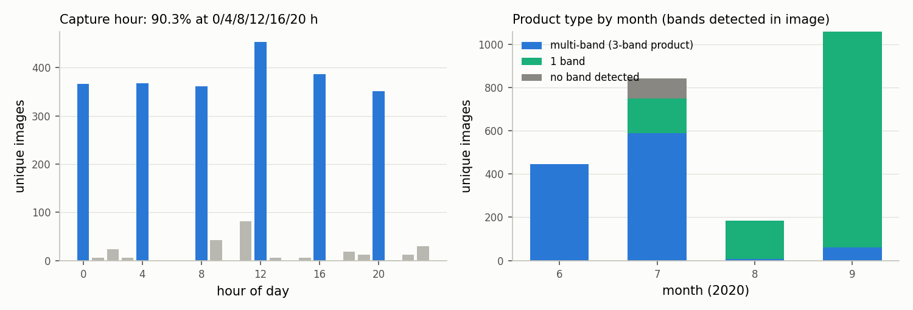 | — | — |
| 6 | 제1장 · 결측·중복·불균형 진단 · 표 · 앞: "\| 픽셀 해시 중복 \| BMP 2,809개 …" | \| 라벨 커버리지 \| TXT 500개 = 고유 영상의 19.7%(호기별 156/177/167), 객체 1,147개(이미지당 1개 176장, 3개 323장) \| 지도학습·평가는 라벨셋으로 함. 미라벨 2,032장은 추론·모니터링에만 사용 \| | \| 라벨 커버리지 \| TXT 500개 = 고유 영상의 19.7%(호기별 156/177/167), 객체 1,147개(이미지당 1개 176장, 2개 1장, 3개 323장) \| 지도학습·평가는 라벨셋으로 함. 미라벨 2,032장은 추론·모니터링에만 사용 \| | B-2 | — |
| 7 | 제1장 · 결측·중복·불균형 진단 · 표 · 앞: "\| 라벨 커버리지 \| TXT 500개 = 고…" | \| 음성(이물 없음) \| 빈 TXT **0개** → 진짜 음성 영상 0장. 빈 XML 810개는 음성이 아님 \| 실제 픽셀 기반 음성 대용 지표 설계(§제2장) \| | \| 음성(이물 없음) \| 빈 TXT **0개** → 진짜 음성 영상 0장. 빈 XML 810개는 음성이 아님 \| 실제 픽셀 기반 대리 음성(negative proxy) 지표 설계(§제2장) \| | 용어 | — |
| 8 | 제1장 · 결측·중복·불균형 진단 · 표 · 앞: "\| 실습용 추가 TXT \| 15개 중 3개는…" | \| 라벨 누락 \| 마킹 3개·TXT 2개인 영상 1장(가운데 띠 끝 이물 누락, 제3장 FP 감사에서 확인) \| 평가는 공식 정답 TXT 그대로, 해석에 반영 \| | \| 라벨 누락 \| 장비 표시 3개·TXT 2개인 영상 1장(가운데 띠 끝 이물 누락, 제3장 FP 감사에서 확인) \| 평가는 공식 정답 TXT 그대로, 해석에 반영 \| | R-7 | — |
| 9 | 제1장 · 장비 색상 표시의 진단 — 가장 큰 위험(표시 누수 · ◦ 1단계 · 앞: "\| 라벨 누락 \| 장비 표시 3개·TXT 2…" | ◦ **장비 색상 표시의 진단 — 가장 큰 위험(누수)** | ◦ **장비 색상 표시의 진단 — 가장 큰 위험(표시 누수, label leakage)** | 용어 | — |
| 10 | 제1장 · 장비 색상 표시의 진단 — 가장 큰 위험(표시 누수 · - 2단계 · 앞: "- 표시가 있는 영상은 **2,809 / 2…" | - TXT 객체 중심의 **1,145 / 1,147(99.8%)이 표시 안**에 있고, 중심 편차는 약 0.9px임 → TXT는 장비 표시를 옮겨 그린 것임〔그림 1-2〕 | - TXT 객체 중심의 **1,145 / 1,147(99.8%)이 표시 안**에 있고, 중심 편차의 표준편차는 약 0.9px임 → TXT는 장비 표시를 옮겨 그린 것임〔그림 1-2〕 | B-4 | — |
| 11 | 제1장 · 장비 색상 표시의 진단 — 가장 큰 위험(표시 누수 · 그림 위치 표시(HWPX 반영 불필요) · 앞: "- TXT 객체 중심의 **1,145 / 1…" | > **[그림 삽입 위치]** `outputs/figures/data_label_overlay.png` | > **[그림 삽입 위치]** `outputs/figures_report/data_label_overlay.png` | R-11 | — |
| 12 | 제1장 · 장비 색상 표시의 진단 — 가장 큰 위험(표시 누수 · 그림 미리보기 줄(HWPX 반영 불필요) · 앞: "> **[그림 삽입 위치]** `output…" | > 〔그림 1-2〕 원본 BMP(장비 색상 표시 포함) 위에 TXT 정답 박스(청록)를 겹쳐 그린 호기별 예시(위: 전체, 아래: 확대). TXT 박스가 장비 표시 사각형 안에 그려져 있음 → 표시 위치만으로 정답을 맞힐 수 있는 누수 구조 | > 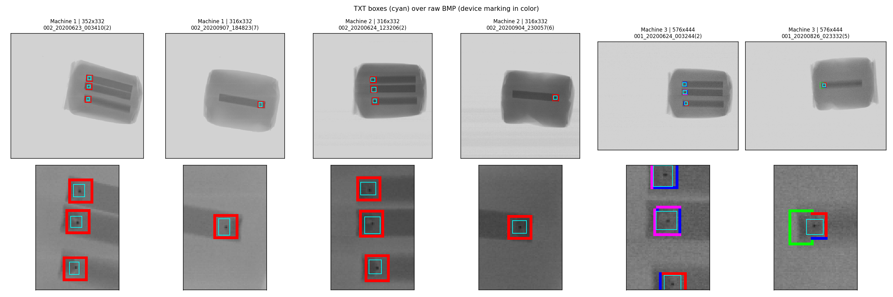 | 용어 | — |
| 13 | 제1장 · 장비 색상 표시의 진단 — 가장 큰 위험(표시 누수 · 그림 캡션 · 앞: ">  | > 〔그림 1-2〕 원본 BMP(장비 색상 표시 포함) 위에 TXT 정답 박스(청록)를 겹쳐 그린 호기별 예시(위: 전체, 아래: 확대, 그림 속 Machine 1–3 = 1–3호기). TXT 박스가 장비 표시 사각형 안에 그려져 있음 → 표시 위치만으로 정답을 맞힐 수 있는 누수 구조 | C-1 | — |
| 14 | 제1장 · 장비 색상 표시의 진단 — 가장 큰 위험(표시 누수 · - 2단계 · 앞: "- 영상을 보지 않고 **표시 위치만 쓰는 …" | - 표시 테두리 바깥 1px이 주변보다 약 6 gray(평균 10), 2px은 약 1.5–5 gray 어두운 **후광**이 있음 → 그레이스케일 변환이나 테두리만 지우는 처리로는 흔적이 남음〔그림 1-3〕 | - 표시 테두리 바깥 1px이 4–8px 지점보다 중앙값 6.0(평균 10.6) gray, 2px은 중앙값 1.5(평균 5.2) gray 어두운 **후광(halo)**이 있음 → 그레이스케일 변환이나 테두리만 지우는 처리로는 흔적이 남음〔그림 1-3〕 | #5 | — |
| 15 | 제1장 · 장비 색상 표시의 진단 — 가장 큰 위험(표시 누수 · 그림 위치 표시(HWPX 반영 불필요) · 앞: "- 표시 테두리 바깥 1px이 4–8px 지…" | > **[그림 삽입 위치]** `outputs/figures/data_marking_halo.png` | > **[그림 삽입 위치]** `outputs/figures_report/data_marking_halo.png` | R-11 | — |
| 16 | 제1장 · 장비 색상 표시의 진단 — 가장 큰 위험(표시 누수 · 그림 미리보기 줄(HWPX 반영 불필요) · 앞: "> **[그림 삽입 위치]** `output…" | > 〔그림 1-3〕 장비 표시 테두리 주변의 밝기 프로파일(평균). (왼쪽) 테두리 바깥: 4–8px 지점 대비 1px −10.6, 2px −5.2, 3px −1.6 gray(제품 위). (오른쪽) 테두리 안쪽: 3–4px 지점 대비 1px +4.4, 2px +2.2 gray → 안팎 2px까지 흔적이 남아 표시를 2px 대칭 팽창해 함께 지움 | > 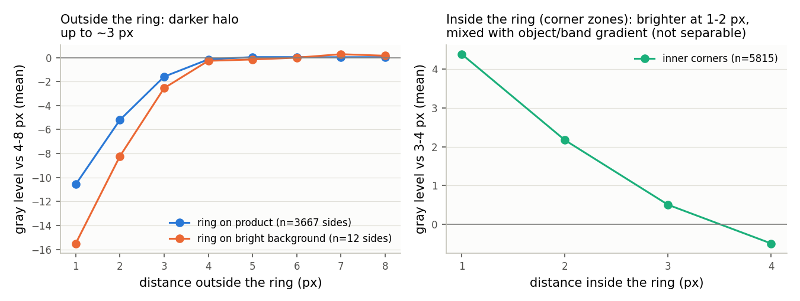 | 용어 | — |
| 17 | 제1장 · 장비 색상 표시의 진단 — 가장 큰 위험(표시 누수 · 그림 캡션 · 앞: ">  | > 〔그림 1-3〕 장비 표시 테두리 주변의 밝기 프로파일(평균). (왼쪽) 테두리 바깥: 4–8px 지점 대비 1px −10.6, 2px −5.2, 3px −1.6 gray(제품 위). (오른쪽) 테두리 안쪽 모서리 구역: 3–4px 지점 대비 1px +4.4, 2px +2.2 gray로 밝지만 이물·띠의 밝기 기울기와 섞여 후광만 분리할 수 없음 → 안쪽도 바깥과 같다고 보고 표시를 2px 대칭 팽창해 함께 지움 | #6 | — |
| 18 | 제1장 · 상세 전처리 내역 · 표 · 앞: "\|---\|---\|---\|…" | \| ① 표시 검출 \| 팔레트 인덱스 ≥ 244 \| 손실 없이 정확히 검출. 처리 후 4,032장에 해당 픽셀 0개 \| | \| ① 표시 검출 \| 팔레트 인덱스 ≥ 244 \| 손실 없이 정확히 검출. 처리 후 4,032장(평가용 clean 2,532 + 학습 사본 500×3)에 해당 픽셀 0개 \| | #7 | — |
| 19 | 제1장 · 상세 전처리 내역 · 표 · 앞: "\| ② 후광 포함 마스크 \| 표시를 **2p…" | \| ③ 채움 \| **Telea 인페인팅 + 밝기별 잡음 합성(telea_n)** \| 영상별 밝기 구간 잡음 σ(1·2호기 약 1.4, 3호기 약 3)를 더해 매끈한 패치가 단서가 되지 않게 함. 바깥 채우기·방향 보간은 띠 끝에 사각형·십자 흔적이 남아 기각〔그림 1-4〕 \| | \| ③ 채움 \| **Telea 인페인팅 + 밝기별 잡음 합성(telea_n)** \| 영상별 밝기 구간 잡음 σ(제품 밝기 기준 1·2호기 약 1.2–1.6, 3호기 약 3.5)를 더해 매끈한 패치가 단서가 되지 않게 함. 바깥 채우기·방향 보간은 띠 끝에 사각형·십자 흔적이 남아 기각〔그림 1-4〕 \| | #23 | — |
| 20 | 제1장 · 상세 전처리 내역 · 표 · 앞: "\| ③ 채움 \| **Telea 인페인팅 + …" | \| ④ 흔적-이물 독립화 (학습 사본에만 적용) \| (a) **가짜 표시(decoy)**: 실측 후광까지 합성해 이물 없는 반대편 띠 끝·제품·배경에 실제 표시 수의 2~3배로 그린 뒤 같은 방식으로 지움 (b) **링 없는 이식**: 이물 투과율 T = I/B를 흔적 없는 위치에 곱해 붙임(Beer–Lambert) (c) **흔적 음성**: 실제 이물 30%의 코어를 지우고 라벨을 뺌〔그림 1-5·1-6〕 \| (a) 흔적 O·이물 X, (b) 이물 O·흔적 X, (c) 실제 흔적 O·이물 X를 만들어 흔적과 이물을 통계적으로 독립시킴. 같은 영상 안에서만 옮기므로 fold 간 누수가 없음 \| | \| ④ 흔적-이물 탈상관(decorrelation) (학습 사본에만 적용) \| (a) **모조 표시(decoy)**: 실측 후광까지 합성해 이물 없는 반대편 띠 끝·제품·배경에 실제 표시 수의 2~3배로 그린 뒤 같은 방식으로 지움 (b) **링 없는 이식**: 이물 투과율 T = I/B를 흔적 없는 위치에 곱해 붙임(Beer–Lambert) (c) **흔적 음성 샘플**: 실제 이물 30%의 코어를 지우고 라벨을 뺌〔그림 1-5·1-6〕 \| (a) 흔적 O·이물 X, (b) 이물 O·흔적 X, (c) 실제 흔적 O·이물 X를 만들어 흔적과 이물을 통계적으로 독립시킴. 같은 영상 안에서만 옮기므로 fold 간 누수가 없음 \| | #13, 용어 | — |
| 21 | 제1장 · 상세 전처리 내역 · 표 · 앞: "\| ⑤ 평가·추론 입력 \| 실제 표시만 지운…" | \| 금지한 처리 \| 중앙값 필터 등 평활화 \| 사전 실험에서 3×3 중앙값 필터가 recall을 0으로 만듦(2–4px 점 소실) \| | \| 금지한 처리 \| 중앙값 필터 등 평활화 \| 사전 실험의 HGB 교란 실험에서 3×3 중앙값 필터가 recall을 0으로 만듦(2–4px 점 소실) \| | #10 | — |
| 22 | 제1장 · 상세 전처리 내역 · 그림 위치 표시(HWPX 반영 불필요) · 앞: "\| 금지한 처리 \| 중앙값 필터 등 평활화 …" | > **[그림 삽입 위치]** `outputs/figures/qc_inpaint_methods.png` | > **[그림 삽입 위치]** `outputs/figures_report/qc_inpaint_methods.png` | R-11 | — |
| 23 | 제1장 · 상세 전처리 내역 · 그림 미리보기 줄(HWPX 반영 불필요) · 앞: "> **[그림 삽입 위치]** `output…" | (없음 — 새 줄 추가) | > 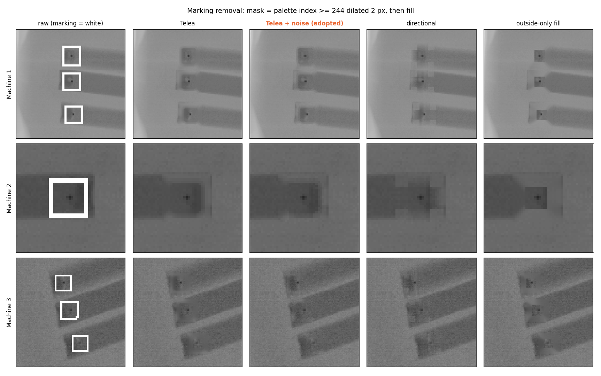 | — | — |
| 24 | 제1장 · 상세 전처리 내역 · 그림 위치 표시(HWPX 반영 불필요) · 앞: "> 〔그림 1-4〕 표시 제거 방식 비교(호…" | > **[그림 삽입 위치]** `outputs/figures/qc_decoy_examples.png` | > **[그림 삽입 위치]** `outputs/figures_report/qc_decoy_examples.png` | R-11 | — |
| 25 | 제1장 · 상세 전처리 내역 · 그림 미리보기 줄(HWPX 반영 불필요) · 앞: "> **[그림 삽입 위치]** `output…" | > 〔그림 1-5〕 가짜 표시(decoy) 증강. 위: 평가·추론 입력(실제 표시만 지운 clean 영상). 아래: 학습 사본 — 점선 원 위치에 후광까지 합성한 가짜 표시를 그린 뒤 실제 표시와 같은 방식으로 지움(원 색 = 위치 종류: 띠 끝·띠·제품·배경, 초록 사각형 = TXT 이물). 지운 자리는 실제 표시를 지운 자리와 구분되지 않음 → '지운 흔적 = 이물' 관계를 끊음 | > 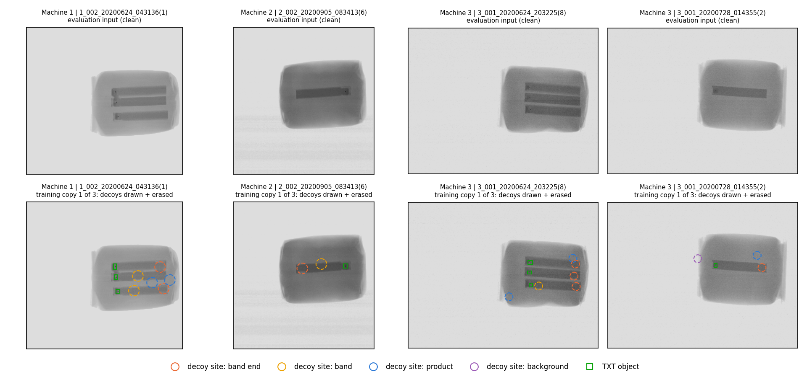 | 용어 | — |
| 26 | 제1장 · 상세 전처리 내역 · 그림 캡션 · 앞: ">  | > 〔그림 1-5〕 모조 표시(decoy) 증강. 위: 평가·추론 입력(실제 표시만 지운 clean 영상). 아래: 학습 사본(영상마다 모조 표시 배치가 다른 사본 3개 중 첫 번째) — 점선 원 위치에 후광까지 합성한 모조 표시를 그린 뒤 실제 표시와 같은 방식으로 지움(원 색 = 위치 종류: 띠 끝·띠·제품·배경, 초록 사각형 = TXT 이물). 지운 자리는 실제 표시를 지운 자리와 구분되지 않음 → ‘지운 흔적 = 이물’ 관계를 끊음 | #8, 용어 | — |
| 27 | 제1장 · 상세 전처리 내역 · 그림 위치 표시(HWPX 반영 불필요) · 앞: "> 〔그림 1-5〕 모조 표시(decoy) …" | > **[그림 삽입 위치]** `outputs/figures/qc_transplant_examples.png` | > **[그림 삽입 위치]** `outputs/figures_report/qc_transplant_examples.png` | R-11 | — |
| 28 | 제1장 · 상세 전처리 내역 · 그림 미리보기 줄(HWPX 반영 불필요) · 앞: "> **[그림 삽입 위치]** `output…" | > 〔그림 1-6〕 흔적-이물 독립화의 나머지 두 경우. (a) 흔적 없는 이물: 실제 이물의 투과율을 흔적이 없는 위치에 곱해 이식(주황 = 이식, 초록 = 실제 이물, 아래 = 이식 확대). (b) 이물 없는 흔적(v2b): 실제 이물의 코어를 지우고 라벨을 뺌(위 = 원본, 아래 = 삭제 후, 점선 = 원래 박스). 호기별 예시 | > 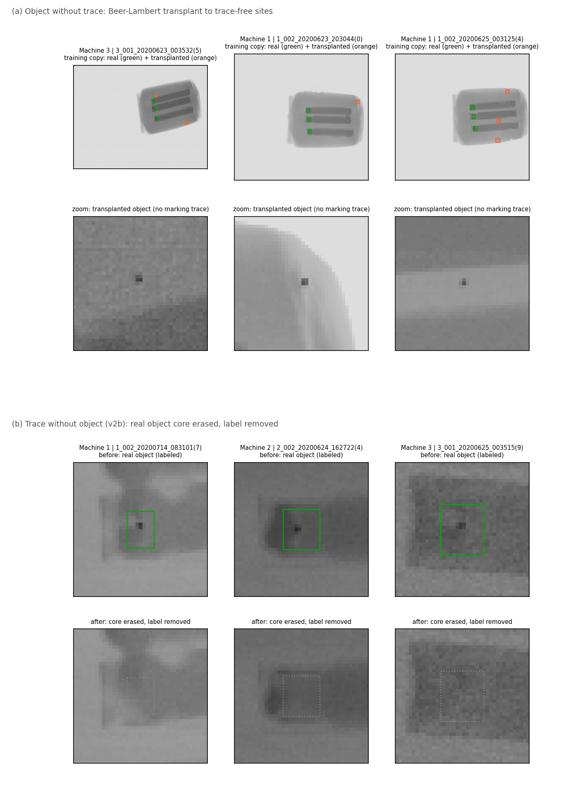 | 용어 | — |
| 29 | 제1장 · 상세 전처리 내역 · 그림 캡션 · 앞: ">  | > 〔그림 1-6〕 흔적-이물 탈상관의 나머지 두 경우. (a) 흔적 없는 이물: 실제 이물의 투과율을 흔적이 없는 위치에 곱해 이식(주황 = 이식, 초록 = 실제 이물, 아래 = 이식 확대). (b) 이물 없는 흔적(v2b): 실제 이물의 코어를 지우고 라벨을 뺌(위 = 원본, 아래 = 삭제 후, 점선 = 원래 박스). 호기별 예시 | 용어 | — |
| 30 | 제1장 · 분석 목적과의 연결 및 검증 전략 · - 2단계 · 앞: "◦ **분석 목적과의 연결 및 검증 전략**…" | - 라벨 객체는 모두 제품 경계에서 37px 이상 안쪽(중앙값 52px)에 있고, 깊이 32–71 gray의 고대비 점뿐임 → 과제가 묻는 '작은·저대비·가장자리 이물'의 미탐지 조건은 실제 데이터에 없으므로 **통제 스트레스 시험**으로 분석함(제3장) | - 라벨 객체는 모두 제품 경계에서 37px 이상 안쪽(중앙값 52px)에 있고, 깊이 32–71 gray의 고대비 점뿐임 → 과제가 묻는 ‘작은·저대비·가장자리 이물’의 미탐지 조건은 실제 데이터에 없으므로 **통제 스트레스 시험**으로 분석함(제3장) | 용어 | — |
| 31 | 제1장 · 분석 목적과의 연결 및 검증 전략 · * 3단계 · 앞: "- 분할: 그룹 = **달력 날짜(전 호기 …" | * 동결 테스트: 100장·178객체(7개 날짜, 4개 월, 3개 호기). 마지막에 한 번만 평가 | * 동결 테스트: 100장·178객체(7개 날짜, 4개 월, 3개 호기). 마지막에 한 번만 평가. 06-23·06-24는 하루 라벨이 104–108장(합 42%)이라 하나만 넣어도 테스트 목표 크기(약 100장)를 채워 날짜·월 다양성 조건을 만족할 수 없으므로 dev에 고정(서로 다른 fold) | #18 | — |
| 32 | 제1장 · 분석 목적과의 연결 및 검증 전략 · - 2단계 · 앞: "* 추가 일반화 평가: 호기 hold-out…" | - 음성 부족 대응: 같은 제품 배경의 실제 픽셀에서 정답 주변(12px)을 뺀 영역의 최대 점수(bg_max)를 음성 영상 점수의 대용으로 씀. 이미지 정밀도 대신 FPPI(이미지당 FP)를 보고하고 유병률 시나리오로 환산함 | - 음성 부족 대응: 같은 제품 배경의 실제 픽셀에서 정답 주변(12px)을 뺀 영역의 최대 점수(bg_max)를 대리 음성(negative proxy) 점수로 씀. 이미지 정밀도 대신 FPPI(이미지당 FP)를 보고하고 이물 혼입률(AI 판정기에 들어오는 영상 중 실제 이물이 있는 영상의 비율) 시나리오로 환산함 | 용어 | — |
| 33 | 제2장 · 문제 정의와 동일 평가조건 · - 2단계 · 앞: "- 모든 모델의 공통 조건: 분할 `spli…" | - 사전 고정한 선정 기준: ① dev OOF Recall@FPPI≤0.1 → ② F1 → ③ AP50:95 → ④ 추론 속도. 지름길 시험 통과는 필수 조건 | - 사전 고정한 선정 기준: ① dev OOF Recall(FPPI≤0.1: 이미지당 과검 0.1개 이하가 되는 임계값에서의 객체 recall) → ② F1 → ③ AP50:95 → ④ 추론 속도. 통과 기준이 있는 누수 검증 시험(T3–T7) 통과는 필수이고, T1·T2·T8은 진단 결과로 보고함. 문맥 단서 의존 점검은 v1 결과를 본 뒤 필수 기준에 추가함(아래 선정 근거) | R-1·R-2 | — |
| 34 | 제2장 · 비교 모델 · 표 · 앞: "\| M2 \| YOLOv8s 기본 헤드(P3–…" | \| M1·M2-v2b \| 학습 사본에 흔적 음성(c)을 추가 \| 위와 같음 \| | \| M1·M2-v2b \| 학습 사본에 흔적 음성 샘플(c)을 추가 \| 위와 같음 \| | 용어 | — |
| 35 | 제2장 · dev OOF 비교 (400장·969객체) · 표 · 앞: "◦ **dev OOF 비교 (400장·969…" | \| 모델 \| AP50 \| AP75 \| AP50:95 \| R@FPPI 0.1 \| F1 \| 배경 과검 bg_max p99 \| | \| 모델 \| AP50 \| AP75 \| AP50:95 \| Recall(FPPI≤0.1) \| F1 \| 배경 과검 bg_max p99 \| | R-1 | — |
| 36 | 제2장 · dev OOF 비교 (400장·969객체) · - 2단계 · 앞: "\| **M2-v2b (P3, 최종)** \| …" | - IoU 0.5 기준으로는 고전 모델(M0)도 포화됨(띠 끝의 고대비 점). 그래서 **박스 정밀도(AP50:95), 배경 과검, 지름길 강건성, 저대비 강건성, 속도**에서 차이가 드러남 | - IoU 0.5 기준으로는 고전 모델(M0)도 포화됨(띠 끝의 고대비 점). 그래서 **박스 정밀도(AP50:95), 배경 과검, 표시 누수 강건성, 저대비 강건성, 속도**에서 차이가 드러남 | 용어 | — |
| 37 | 제2장 · dev OOF 비교 (400장·969객체) · - 2단계 · 앞: "- IoU 0.5 기준으로는 고전 모델(M0…" | - **COCO 사전학습의 기여**: 같은 구조에서 scratch 대비 AP50 +1.4%p, 배경 고신뢰 과검(bg_max p99) 0.197 → 0.034, 1객체 AP75 0.060 → 0.156 → 외부 가중치 사용의 근거 | - **COCO 사전학습의 기여**: 같은 구조(M1, P2 헤드·v1 사본)에서 scratch(M1-s) 대비 AP50 +1.4%p, 배경 고신뢰 과검(bg_max p99) 0.197 → 0.034, 1객체 AP75 0.060 → 0.156 → 외부 가중치 사용의 근거 | B-3 | — |
| 38 | 제2장 · dev OOF 비교 (400장·969객체) · - 2단계 · 앞: "- **COCO 사전학습의 기여**: 같은 …" | - 추론 시간(OOF 추론, GPU batch 16): M0 약 65ms/장(CPU), M1 약 8–10ms/장, M2-v2b 약 6.5ms/장 | - 추론 시간(OOF 일괄 추론): M1 약 8–10ms/장, M2-v2b 약 6.5ms/장(GPU, batch 16), M0 약 49–71ms/장(CPU, fold별). batch 1 처리 시간은 제4장 | R-5 | — |
| 39 | 제2장 · dev OOF 비교 (400장·969객체) · - 2단계 · 앞: "- 추론 시간(OOF 일괄 추론): M1 약…" | - v1 모델(M1·M2)은 OOF가 v2b보다 0.3–0.4%p 높지만, 아래 문맥 지름길 점검에서 불합격함 | - v1 모델(M1·M2)은 OOF가 v2b보다 0.3–0.4%p 높지만, 아래 문맥 단서 의존(단축 학습, shortcut learning) 점검에서 불합격함 | 용어 | — |
| 40 | 제2장 · 표시 누수(label leakage)·단축 학습(s · ◦ 1단계 · 앞: "- v1 모델(M1·M2)은 OOF가 v2b…" | ◦ **지름길(표시 누수) 검증 — 사전 고정 기준**〔그림 2-1〕 | ◦ **표시 누수(label leakage)·단축 학습(shortcut learning) 검증 — 사전 고정 기준**〔그림 2-1〕 | 용어 | — |
| 41 | 제2장 · 표시 누수(label leakage)·단축 학습(s · 표 · 앞: "\|---\|---\|---:\|---:\|---:\|…" | \| T2 \| 표시만 쓰는 탐지기 F1 / 원본 학습 모델을 표시 제거 영상에서 평가(AP50) \| 0.94 / — \| 원본 학습 0.974 → **0.699** \| — \| 진단(누수 크기) \| | \| T2 \| 표시만 쓰는 탐지기 F1 / 원본 학습 모델을 표시 제거 영상에서 평가(AP50) \| 0.94 / — \| 원본 학습 0.974 → **0.699**(M1 구조, 표시가 남은 그레이스케일 영상으로 학습, fold 3 94장 평가) \| — \| 진단(누수 크기) \| | #11 | — |
| 42 | 제2장 · 표시 누수(label leakage)·단축 학습(s · 표 · 앞: "\| T2 \| 표시만 쓰는 탐지기 F1 / 원…" | \| T3 \| 가짜 표시 2,408개 자리 발화율 \| 0.0% \| 0.0% \| 0.0% \| 배경 수준 \| | \| T3 \| 모조 표시 2,408개 위치의 오검출률 \| 0.0% \| 0.0% \| 0.0% \| 배경 수준 \| | 용어 | — |
| 43 | 제2장 · 표시 누수(label leakage)·단축 학습(s · 표 · 앞: "\| T3 \| 모조 표시 2,408개 위치의 …" | \| T4 \| 이물만 지우고 흔적을 남긴 자리 발화율 \| 2.6% \| 0.4% \| **0.0%** \| ≤ 5% \| | \| T4 \| 이물만 지우고 흔적을 남긴 위치의 오검출률 \| 2.6% \| 0.4% \| **0.0%** \| ≤ 5% \| | 용어 | — |
| 44 | 제2장 · 표시 누수(label leakage)·단축 학습(s · 표 · 앞: "\| T5 \| 흔적 없는 위치로 이식한 이물 …" | \| T6 \| 이물 없는 반대편 띠 끝 발화율 \| 0.2% \| 0.1% \| 0.1% \| 배경 수준 \| | \| T6 \| 이물 없는 반대편 띠 끝의 오검출률 \| 0.2% \| 0.1% \| 0.1% \| 배경 수준 \| | 용어 | — |
| 45 | 제2장 · 표시 누수(label leakage)·단축 학습(s · 표 · 앞: "\| T6 \| 이물 없는 반대편 띠 끝의 오검…" | \| T7 \| 코어 차폐 / 링 영역 차폐 후 recall \| 0.23 / 0.996 \| 0.15 / 1.000 \| **0.001 / 1.000** \| 코어 ≪ 링 \| | \| T7 \| 코어 가림(occlusion) / 링 영역 가림 후 recall \| 0.23 / 0.996 \| 0.15 / 1.000 \| **0.001 / 1.000** \| 코어 ≪ 링 \| | B-6 | — |
| 46 | 제2장 · 표시 누수(label leakage)·단축 학습(s · 표 · 앞: "\| T7 \| 코어 가림(occlusion) …" | \| 스트레스 \| 이물을 거의 지운(α=0.1) 원위치 recall \| 0.196 \| 0.219 \| **0.006** \| 문맥 지름길 점검 \| | \| T8 \| 전처리만 바꿔 학습한 HGB(모조 표시·이식 없음, 변형 8종)의 이물 삭제 위치 오검출률 \| 5–40% \| — \| — \| 진단(전처리만으로는 부족) \| | #13, 용어 | — |
| 47 | 제2장 · 표시 누수(label leakage)·단축 학습(s · 표 · 앞: "\| T8 \| 전처리만 바꿔 학습한 HGB(모…" | \| T1 \| 실제 흔적 vs 가짜 흔적 판별 AUC(데이터 수준) \| 0.94–0.99 \| — \| — \| ≤ 0.60 **불합격** \| | \| 스트레스 \| 이물을 거의 지운(α=0.1) 원위치 recall \| 0.196 \| 0.219 \| **0.006** \| 문맥 단서 의존 점검 \| | #13 | — |
| 48 | 제2장 · 표시 누수(label leakage)·단축 학습(s · 표 · 앞: "\| 스트레스 \| 이물을 거의 지운(α=0.1…" | (없음 — 새 줄 추가) | \| T1 \| 실제 흔적 vs 모조 흔적 판별 AUC(데이터 수준) \| 0.94–0.99 \| — \| — \| ≤ 0.60 **불합격** \| | 용어 | — |
| 49 | 제2장 · 표시 누수(label leakage)·단축 학습(s · 그림 위치 표시(HWPX 반영 불필요) · 앞: "\| T1 \| 실제 흔적 vs 모조 흔적 판별…" | > **[그림 삽입 위치]** `outputs/figures/report_leak_summary.png` | > **[그림 삽입 위치]** `outputs/figures_report/report_leak_summary.png` | R-11 | — |
| 50 | 제2장 · 표시 누수(label leakage)·단축 학습(s · 그림 미리보기 줄(HWPX 반영 불필요) · 앞: "> **[그림 삽입 위치]** `output…" | > 〔그림 2-1〕 지름길 시험 요약(dev OOF, 모델별 같은 조건). 왼쪽부터 ① 이물만 지운 자리의 발화율(T4, 낮을수록 흔적 의존 없음) ② 흔적 없는 위치로 이식했을 때 recall 감소폭(T5) ③ 이물을 거의 지운(α=0.1) 원위치 recall(낮을수록 문맥 지름길 없음) ④ 흔적 없는 위치 recall(α=1, 높을수록 좋음). 최종모델(가장 오른쪽 막대)은 T4 0%, 원위치 바닥값 0.6% | > 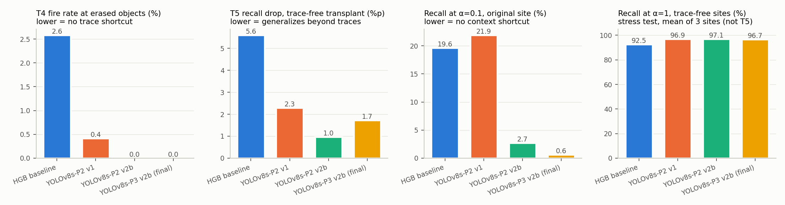 | 용어 | — |
| 51 | 제2장 · 표시 누수(label leakage)·단축 학습(s · 그림 캡션 · 앞: ">  | > 〔그림 2-1〕 누수 검증 시험 요약(dev OOF, 모델별 같은 조건). 왼쪽부터 ① 이물만 지운 위치의 오검출률(T4, 낮을수록 흔적 의존 없음) ② 흔적 없는 위치로 이식했을 때 recall 감소폭(T5) ③ 이물을 거의 지운(α=0.1) 원위치 recall(낮을수록 문맥 단서 의존 없음) ④ 스트레스 시험 α=1에서 흔적 없는 세 위치 recall 평균(높을수록 좋음, T5 이식 시험과 다른 지표). 최종모델(가장 오른쪽 막대)은 T4 0%, 원위치 잔여 검출률 0.6% | #14 | — |
| 52 | 제2장 · 표시 누수(label leakage)·단축 학습(s · - 2단계 · 앞: "- T1은 사전 기준에 **불합격**함. 다…" | - T7: 링 영역을 가려도 점수가 유지되고(평균 0.68 → 0.67), 코어를 가리면 무너짐(0.68 → 0.04) → **모델은 이물 코어를 보고 판정함** | - T7(최종모델): 링 영역을 가려도 평균 점수가 유지되고(0.70 → 0.70), 코어를 가리면 무너짐(0.70 → 0.01) → **모델은 이물 코어를 보고 판정함** | #12 | — |
| 53 | 제2장 · 표시 누수(label leakage)·단축 학습(s · - 2단계 · 앞: "- T7(최종모델): 링 영역을 가려도 평균…" | - v1의 남은 위험: 이물을 거의 지운 상태(α=0.1)에서도 원위치에서 약 20%를 검출함 → 실제 흔적이 있는 자리에는 항상 이물이 있다는 학습 분포 때문에 생긴 **문맥 지름길**. 흔적 음성(c)을 더한 v2b로 0.6%까지 제거함(최종모델) | - v1의 남은 위험: 이물을 거의 지운 상태(α=0.1)에서도 원위치에서 약 20%를 검출함 → 실제 흔적이 있는 자리에는 항상 이물이 있다는 학습 분포 때문에 생긴 **문맥 단서 의존(단축 학습)**. 흔적 음성 샘플(c)을 더한 v2b로 0.6%까지 줄임(최종모델) | 용어 | — |
| 54 | 제2장 · 표시 누수(label leakage)·단축 학습(s · * 3단계 · 앞: "- v1의 남은 위험: 이물을 거의 지운 상…" | * 사전 점검(HGB, 5×5 코어 삭제판 v2): 원위치 바닥값 0.196 → 0.005, 흔적 없는 위치 recall α=1 +1–4%p, α=0.6 +13–21%p. 박스 안쪽만 지우는 엄격한 방식으로 잰 '이물 삭제 자리 발화율'은 13.2% → 0.2% | * 사전 점검(HGB, 5×5 코어 삭제판 v2): 원위치 잔여 검출률 0.196 → 0.005, 흔적 없는 위치 recall α=1 +1–4%p, α=0.6 +13–21%p. 박스 안쪽만 지우는 엄격한 방식으로 잰 ‘이물 삭제 위치 오검출률’은 13.2% → 0.2% | 용어 | — |
| 55 | 제2장 · 표시 누수(label leakage)·단축 학습(s · * 3단계 · 앞: "* 사전 점검(HGB, 5×5 코어 삭제판 …" | * 5×5 삭제는 점 신호가 남아(1·2호기 잔존 12/10 vs 빈 띠 끝 기준선 6) 희미한 이물을 음성으로 가르치는 결함이 있어, 코어 마스크 삭제(v2b, 잔존 7 vs 기준선 6)로 교체함 | * 5×5 삭제는 점상 신호가 남아(1·2호기 잔존 12/10 vs 빈 띠 끝 기준선 6) 희미한 이물을 음성으로 가르치는 결함이 있어, 코어 마스크 삭제(v2b, 잔존 7 vs 기준선 6)로 교체함 | 용어 | — |
| 56 | 제2장 · 최종모델 선정 근거 · - 2단계 · 앞: "◦ **최종모델 선정 근거**…" | - 사전 기준에 '원위치 문맥 지름길(α=0.1 원위치 recall)'을 필수 점검으로 추가함. 표시에서 비롯된 흔적을 단서로 쓰는 것이므로 **규정 준수를 점수보다 우선**함 | - v1 모델(HGB·YOLO)의 스트레스 시험에서 원위치 문맥 단서 의존(α=0.1 원위치 recall 0.20–0.22)을 발견한 뒤, v2b 모델 비교 전에 이 점검을 필수 기준으로 추가함(10-02). 표시에서 비롯된 흔적을 단서로 쓰는 것이므로 **규정 준수를 점수보다 우선**함 | A-0 | — |
| 57 | 제2장 · 최종모델 선정 근거 · 표 · 앞: "\|---\|---:\|---:\|…" | \| 필수: α=0.1 원위치 recall / T4 / T7 코어 차폐 \| 0.027 / 0% / 0.008 \| **0.006 / 0% / 0.001** \| | \| 필수: α=0.1 원위치 recall / T4 / T7 코어 가림 \| 0.027 / 0% / 0.008 \| **0.006 / 0% / 0.001** \| | B-6 | — |
| 58 | 제2장 · 최종모델 선정 근거 · 표 · 앞: "\| 필수: α=0.1 원위치 recall /…" | \| ① Recall@FPPI≤0.1 \| 0.976 \| **0.981** \| | \| ① Recall(FPPI≤0.1) \| 0.976 \| **0.981** \| | R-1 | — |
| 59 | 제2장 · 최종모델 선정 근거 · * 3단계 · 앞: "* 트레이드오프: 저대비 스트레스에서는 P2…" | * 3호기 Recall@FPPI는 P3 0.958 대 P2 0.896으로 P3가 크게 우수함 | * 3호기 Recall(FPPI≤0.1)은 P3 0.958 대 P2 0.896으로 P3가 크게 우수함 | R-1 | — |
| 60 | 제2장 · 장비·시간 일반화 (dev 안) · 표 · 앞: "◦ **장비·시간 일반화 (dev 안)**…" | \| 평가 \| AP50 \| R@FPPI 0.1 \| F1 \| | \| 평가 \| AP50 \| Recall(FPPI≤0.1) \| F1 \| | R-1 | — |
| 61 | 제2장 · 장비·시간 일반화 (dev 안) · 표 · 앞: "\|---\|---:\|---:\|---:\|…" | \| 1호기 hold-out (2·3호기로 학습) \| 0.884 (HGB 0.708) \| 0.467 \| 0.937 (HGB 0.839) \| | \| 1호기 hold-out (2·3호기로 학습, 136장·366객체) \| 0.884 (HGB 0.708) \| 0.467 \| 0.937 (HGB 0.839) \| | #17 | — |
| 62 | 제2장 · 장비·시간 일반화 (dev 안) · 표 · 앞: "\| 1호기 hold-out (2·3호기로 학…" | \| 2호기 hold-out (1·3호기로 학습) \| 0.884 (HGB 0.811) \| 0.646 \| 0.930 (HGB 0.861) \| | \| 2호기 hold-out (1·3호기로 학습, 131장·294객체) \| 0.884 (HGB 0.811) \| 0.646 \| 0.930 (HGB 0.861) \| | #17 | — |
| 63 | 제2장 · 장비·시간 일반화 (dev 안) · 표 · 앞: "\| 2호기 hold-out (1·3호기로 학…" | \| 3호기 hold-out (1·2호기로 학습) \| **0.586** (HGB 0.353) \| 0.036 \| **0.761** (HGB 0.484) \| | \| 3호기 hold-out (1·2호기로 학습, 133장·309객체) \| **0.586** (HGB 0.353) \| 0.036 \| **0.761** (HGB 0.484) \| | #17 | — |
| 64 | 제2장 · 장비·시간 일반화 (dev 안) · 표 · 앞: "\| 3호기 hold-out (1·2호기로 학…" | \| 전향 (6–7월 → 8–9월, 3띠 → 1띠) \| **1.000** (HGB 0.985) \| 1.000 \| **1.000** (HGB 0.990) \| | \| 전향 (6–7월 → 8–9월, 3띠 → 1띠, 103장·103객체) \| **1.000** (HGB 0.985) \| 1.000 \| **1.000** (HGB 0.990) \| | #17 | — |
| 65 | 제2장 · 장비·시간 일반화 (dev 안) · - 2단계 · 앞: "- 최종모델 구조(P3 + v2b)로 dev…" | - **시간 변화(3띠 → 1띠 제품)에는 강하지만, 처음 보는 장비로의 일반화는 약함**. 특히 해상도(576×444)와 잡음(σ 약 3)이 다른 3호기는 학습에 없으면 F1 0.761로 떨어짐 → 새 장비에 도입할 때는 해당 장비의 영상으로 재학습이 필요함(제4장) | - **시간 변화(3띠 → 1띠 제품)에는 강하지만, 처음 보는 장비로의 일반화는 약함**. 특히 해상도(576×444)와 잡음(σ 약 3.5)이 다른 3호기는 학습에 없으면 F1 0.761로 떨어짐 → 새 장비에 도입할 때는 해당 장비의 영상으로 재학습이 필요함(제4장) | #23 | — |
| 66 | 제2장 · 3호기 대책 모델 비교 (ablation, 최종모델 · - 2단계 · 앞: "◦ **3호기 대책 모델 비교 (ablati…" | - 가설: 3호기의 약점은 잡음 차이(σ 약 3 대 1.4) 때문이다 → 1·2호기 학습 사본의 50%에 밝기별 잡음을 더해 3호기 수준으로 맞춤(σ 1.50 → 3.55, 3호기 3.62) | - 가설: 3호기의 약점은 잡음 차이(σ 약 3.5 대 1.2–1.6) 때문이다 → 1·2호기 학습 사본의 50%에 밝기별 잡음을 더해 3호기 수준으로 맞춤(밝기 60–160 구간 기준 σ 1.50 → 3.55, 3호기 3.62) | #23 | — |
| 67 | 제2장 · 3호기 대책 모델 비교 (ablation, 최종모델 · 표 · 앞: "\|---\|---:\|---:\|…" | \| dev OOF AP50 / R@FPPI0.1 / F1 \| 0.969 / 0.981 / 0.981 \| 0.949 / 0.967 / 0.967 \| | \| dev OOF AP50 / Recall(FPPI≤0.1) / F1 \| 0.969 / 0.981 / 0.981 \| 0.949 / 0.967 / 0.967 \| | R-1 | — |
| 68 | 제2장 · 3호기 대책 모델 비교 (ablation, 최종모델 · 표 · 앞: "\| dev OOF AP50 / Recall(…" | \| 3호기 R@FPPI0.1 / F1 \| **0.958** / 0.959 \| 0.518 / 0.914 \| | \| 3호기 Recall(FPPI≤0.1) / F1 \| **0.958** / 0.959 \| 0.518 / 0.914 \| | R-1 | — |
| 69 | 제2장 · 3호기 대책 모델 비교 (ablation, 최종모델 · 표 · 앞: "\| 3호기 1객체 top-1 점수 중앙값 \|…" | \| 지름길 점검 T4 발화 / T7 코어 차폐 recall \| 0% / 0.001 \| 0% / 0.015 \| | \| 누수 점검 T4 오검출률 / T7 코어 가림 recall \| 0% / 0.001 \| 0% / 0.015 \| | B-6 | — |
| 70 | 제2장 · 3호기 대책 모델 비교 (ablation, 최종모델 · - 2단계 · 앞: "\| 누수 점검 T4 오검출률 / T7 코어 …" | - 해석: 처음 보는 장비로의 일반화는 좋아지지만(F1 +0.064), 3호기를 학습한 실제 운영 조건에서는 3호기 과검이 늘어 R@FPPI가 크게 떨어지고, 점수 척도 문제(제4장)도 해결하지 못함 → **사전 선정 기준으로 채택하지 않음**. 새 장비를 학습 데이터 없이 도입해야 하는 경우의 선택지로만 남김 | - 해석: 처음 보는 장비로의 일반화는 좋아지지만(F1 +0.064), 3호기를 학습한 실제 운영 조건에서는 3호기 과검이 늘어 Recall(FPPI≤0.1)이 크게 떨어지고, 점수 분포 이동 문제(제4장)도 해결하지 못함 → **사전 선정 기준으로 채택하지 않음**. 새 장비를 학습 데이터 없이 도입해야 하는 경우의 선택지로만 남김 | R-1, 용어 | — |
| 71 | 제2장 · 동결 테스트 결과 (100장·178객체, 한 번만  · 표 · 앞: "◦ **동결 테스트 결과 (100장·178객…" | \| 모델 \| AP50 \| AP50:95 \| R@FPPI 0.1 \| P / R / F1 (OOF 임계값) \| 객체 recall 95% CI \| | \| 모델 \| AP50 \| AP50:95 \| Recall(FPPI≤0.1) \| P / R / F1 (OOF 임계값) \| 객체 recall 95% CI \| | R-1 | — |
| 72 | 제2장 · 동결 테스트 결과 (100장·178객체, 한 번만  · - 2단계 · 앞: "- 테스트셋은 EDA와 사전 실험에서 열람된…" | - **3구간 판정의 테스트 결과는 제4장에 따로 보고함**(사전 통과 임계값의 이식 실패, 원인 진단, dev 중첩 시뮬레이션으로 검증한 여유 규칙과 사후 확인) | - **3구간 판정의 테스트 결과는 제4장에 따로 보고함**(사전 통과 임계값의 이식 실패, 원인 진단, dev 중첩 시뮬레이션으로 검증한 마진 규칙과 사후 분석) | 용어 | — |
| 73 | 제3장 · — · 장 제목 · 앞: "- **3구간 판정의 테스트 결과는 제4장에…" | ## 제3장. 영향요인 및 오류분석〔15점〕 | ## □ 제3장. 영향요인 및 오류분석〔15점〕 | B-1 | — |
| 74 | 제3장 · 잘 작동하는 조건 — 실제 데이터 범위 안 · - 2단계 · 앞: "- 실제 데이터 범위(코어 깊이 32–71 …" | - 1·2호기(316–412×332, 잡음 σ 약 1.4)는 recall 0.989·0.997로 잘 작동함 | - 1·2호기(316–412×332, 잡음 σ 약 1.2–1.6)는 recall 0.989·0.997로 잘 작동함 | #23 | — |
| 75 | 제3장 · 미검(FN)이 몰리는 조건 — 실제 데이터 (FN  · - 2단계 · 앞: "◦ **미검(FN)이 몰리는 조건 — 실제 …" | (없음 — 새 줄 추가) | - 미검 18건 중 17건은 운영 임계값 이상의 예측이 같은 이물의 중심을 맞혔으나 박스 IoU < 0.5인 위치 오차임. **중심 적중(center-hit: 예측 박스 중심이 정답 박스 안) 기준 미검은 1건**(점수 0.359 경계) → 아래 표는 ‘놓치는 조건’보다 ‘박스 크기가 어긋나기 쉬운 조건’으로 읽어야 함 | #19 | — |
| 76 | 제3장 · 미검(FN)이 몰리는 조건 — 실제 데이터 (FN  · 표 · 앞: "\| 표시 중첩률 > 0.3(분석 전용) \| …" | \| **3호기(576×444, 잡음 σ 약 3)** \| 309 \| **0.958** \| **13** \| 0.929–0.975 \| | \| **3호기(576×444, 잡음 σ 약 3.5)** \| 309 \| **0.958** \| **13** \| 0.929–0.975 \| | #23 | — |
| 77 | 제3장 · 미검(FN)이 몰리는 조건 — 실제 데이터 (FN  · * 3단계 · 앞: "\| 작은 박스(≤ 80px²) \| 205 \|…" | (없음 — 새 줄 추가) | * 구간 경계는 각 변수 분포의 사분위 부근에서 정한 고정값(예: 코어 깊이 40/45/50/55 gray) | #21 | — |
| 78 | 제3장 · 미검(FN)이 몰리는 조건 — 실제 데이터 (FN  · - 2단계 · 앞: "- 상호작용: 큰 박스 131개 중 113개…" | - 점수 회귀(표준화, 날짜 군집 부트스트랩): 3호기(계수 −0.23), 국소 배경 밝기(−0.22), 박스 면적(−0.21)이 점수를 낮추는 방향이지만 95% CI가 모두 0을 포함함 → 실제 데이터의 조건 범위가 좁아 통계적으로 확정하기 어려움 | - 점수 회귀(목표: IoU 0.5 매칭 점수의 로짓, 설명변수: 코어 깊이·면적, 박스 면적, 국소 배경, 띠 끝 거리, 호기, 3객체 여부, 표시 중첩률(분석 전용), 깊이×3호기, 표준화 선형회귀, 날짜 군집 부트스트랩 500회): 3호기(계수 −0.23), 국소 배경 밝기(−0.22), 박스 면적(−0.21)이 점수를 낮추는 방향이지만 95% CI가 모두 0을 포함함 → 실제 데이터의 조건 범위가 좁아 통계적으로 확정하기 어려움 | #20 | — |
| 79 | 제3장 · 실패하는 조건 — 통제 스트레스 시험(대비 × 위치 · 표 · 앞: "\| 0.3 \| 14 \| 0.227 \| 0.0…" | (없음 — 새 줄 추가) | \| 0.2 \| 9 \| 0.033 \| 0 \| 0.003 \| 0 \| | C-8 | — |
| 80 | 제3장 · 실패하는 조건 — 통제 스트레스 시험(대비 × 위치 · - 2단계 · 앞: "- **가장자리**: 실제 라벨에는 가장자리…" | - **원위치와 흔적 없는 위치의 차이**: α=0.1에서 원위치 0.006 → 문맥 지름길이 제거되어, 원위치에서도 이물 신호가 사라지면 검출하지 않음 | - **원위치와 흔적 없는 위치의 차이**: α=0.1에서 원위치 0.006 → 문맥 단서 의존이 제거되어, 원위치에서도 이물 신호가 사라지면 검출하지 않음 | 용어 | — |
| 81 | 제3장 · 실패하는 조건 — 통제 스트레스 시험(대비 × 위치 · 그림 위치 표시(HWPX 반영 불필요) · 앞: "- **원위치와 흔적 없는 위치의 차이**:…" | > **[그림 삽입 위치]** `outputs/figures/report_stress.png` | > **[그림 삽입 위치]** `outputs/figures_report/report_stress.png` | R-11 | — |
| 82 | 제3장 · 실패하는 조건 — 통제 스트레스 시험(대비 × 위치 · 그림 미리보기 줄(HWPX 반영 불필요) · 앞: "> **[그림 삽입 위치]** `output…" | (없음 — 새 줄 추가) | > 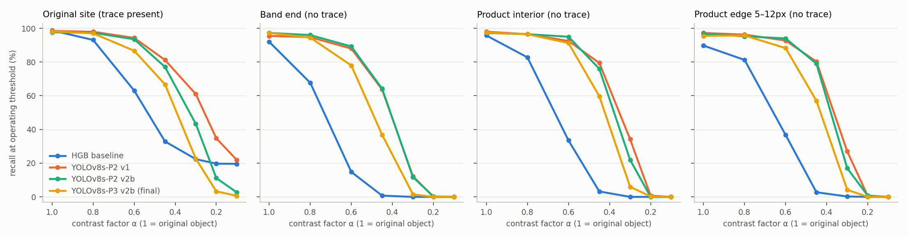 | — | — |
| 83 | 제3장 · IoU 기준 민감도와 박스 관례 · - 2단계 · 앞: "- recall: IoU 0.3에서 0.99…" | - 실제 코어는 2–4px이고 TXT 박스는 약 10px의 관례적 크기임. 예측 박스 중심은 코어에 0.7px 이내로 붙어 있음(GT 중심과는 0.85px) → IoU가 높은 구간의 하락은 '놓침'이 아니라 **박스 크기 관례 불일치**임 | - 실제 코어는 2–4px이고 TXT 박스는 약 10px의 관례적 크기임. 예측 박스 중심과 코어 중심의 거리는 중앙값 0.66px(90%가 1.07px 이하), GT 박스 중심과는 0.83px임 → IoU가 높은 구간의 하락은 ‘놓침’이 아니라 **박스 크기 관례 불일치**임 | #22 | — |
| 84 | 제3장 · 오경보(FP)가 몰리는 조건 · - 2단계 · 앞: "- 최종모델 운영 임계값의 FP 18건 중 …" | - **배경 FP는 1건**뿐이고, 마킹 3개·TXT 2개인 영상의 가운데 띠 끝 이물(점수 0.73)로 **TXT 라벨 누락**임〔그림 3-2〕 | - **배경 FP는 1건**뿐이고, 장비 표시 3개·TXT 2개인 영상의 가운데 띠 끝 이물(점수 0.73)로 **TXT 라벨 누락**임〔그림 3-2〕 | R-7 | — |
| 85 | 제3장 · 오경보(FP)가 몰리는 조건 · - 2단계 · 앞: "- TXT는 장비 표시(최대 3개)를 옮겨 …" | - 이물 없는 띠 끝(T6)의 발화율은 0.1%, 합성 음성 영상(모든 이물 삭제)의 영상 FP율은 0.5%임 | - 이물 없는 띠 끝(T6)의 오검출률은 0.1%, 합성 음성 영상(모든 이물 삭제)의 영상 FP율은 0.5%임 | 용어 | — |
| 86 | 제3장 · 오경보(FP)가 몰리는 조건 · 그림 위치 표시(HWPX 반영 불필요) · 앞: "- 이물 없는 띠 끝(T6)의 오검출률은 0…" | > **[그림 삽입 위치]** `outputs/figures/errors_p3_coco_v2b_fp_audit.png` | > **[그림 삽입 위치]** `outputs/figures_report/errors_p3_coco_v2b_fp_audit.png` | R-11 | — |
| 87 | 제3장 · 오경보(FP)가 몰리는 조건 · 그림 미리보기 줄(HWPX 반영 불필요) · 앞: "> **[그림 삽입 위치]** `output…" | (없음 — 새 줄 추가) | > 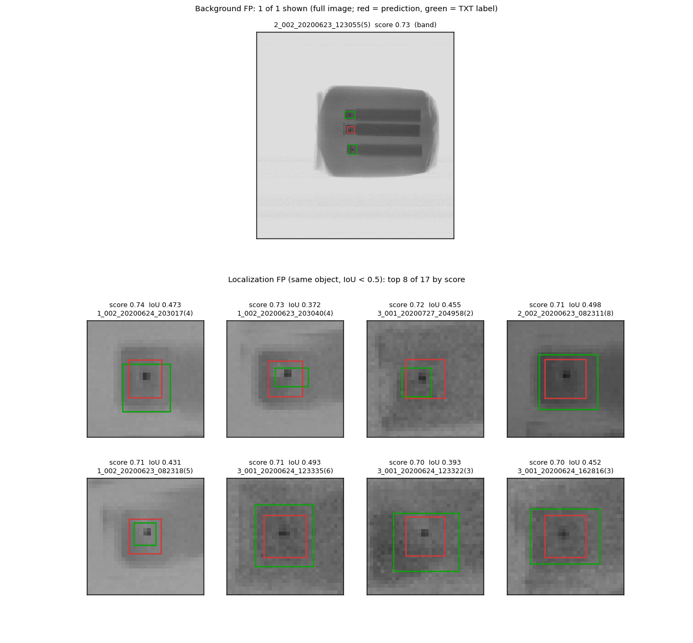 | — | — |
| 88 | 제3장 · 장비·시간 요인 · - 2단계 · 앞: "◦ **장비·시간 요인**…" | - 3호기는 영상이 크고 잡음이 커서 모든 모델에서 가장 약함(최종모델 AP50 0.931, R@FPPI 0.958) | - 3호기는 영상이 크고 잡음이 커서 모든 모델에서 가장 약함(최종모델 AP50 0.931, Recall(FPPI≤0.1) 0.958) | R-1 | — |
| 89 | 제3장 · 장비·시간 요인 · - 2단계 · 앞: "- 동결 테스트(7개 날짜)의 호기별 미검은…" | - **3호기 × 1띠 제품: 탐지는 되지만 점수 척도가 낮음**(판정 임계값 이식 실패의 원인, 제4장) | - **3호기 × 1띠 제품: 탐지는 되지만 점수 분포가 낮게 이동함**(판정 임계값 이식 실패의 원인, 제4장) | 용어 | — |
| 90 | 제3장 · 장비·시간 요인 · * 3단계 · 앞: "* 영상별 최고 점수(top-1) 중앙값: …" | * 같은 박스의 이물 대비(코어 깊이)는 3호기 47–48 gray로 3띠·1띠 시기가 같고, 점수와 대비의 순위상관은 모든 호기에서 \|ρ\| ≤ 0.12 → **YOLO 점수는 '검출 여유'가 아니라 문맥(장비·제품 유형)에 따른 확신도**임 | * 같은 박스의 이물 대비(코어 깊이)는 3호기 47–48 gray로 3띠·1띠 시기가 같고, 점수와 대비의 순위상관은 모든 호기에서 \|ρ\| ≤ 0.12 → **YOLO 점수는 ‘검출 마진’이 아니라 문맥(장비·제품 유형)에 따른 확신도**임 | 용어 | — |
| 91 | 제3장 · 장비·시간 요인 · * 3단계 · 앞: "* 같은 박스의 이물 대비(코어 깊이)는 3…" | * 영상 품질(잡음 σ, 제품·띠 밝기, 띠 대비)은 세 호기 모두 기간 내내 안정적이고, 3호기 1띠 영상 안에서 점수와 품질 지표의 상관은 \|ρ\| ≤ 0.06(347장). 점수 설명력 R²는 호기×제품 유형 0.642, 품질 지표를 더해도 0.643 → 장비 열화가 아니라 **'3호기 × 1띠 제품' 조합 효과**〔그림 3-3〕 | * 영상 품질(잡음 σ, 제품·띠 밝기, 띠 대비)은 세 호기 모두 기간 내내 안정적이고, 3호기 1띠 영상 안에서 점수와 품질 지표의 상관은 \|ρ\| ≤ 0.06(347장). 점수 설명력 R²는 호기×제품 유형 0.642, 품질 지표를 더해도 0.643 → 장비 열화가 아니라 **‘3호기 × 1띠 제품’ 조합 효과**〔그림 3-3〕 | 용어 | — |
| 92 | 제3장 · 장비·시간 요인 · 그림 위치 표시(HWPX 반영 불필요) · 앞: "* 영상 품질(잡음 σ, 제품·띠 밝기, 띠…" | > **[그림 삽입 위치]** `outputs/figures/quality_drift.png` | > **[그림 삽입 위치]** `outputs/figures_report/quality_drift.png` | R-11 | — |
| 93 | 제3장 · 장비·시간 요인 · 그림 미리보기 줄(HWPX 반영 불필요) · 앞: "> **[그림 삽입 위치]** `output…" | > 〔그림 3-3〕 호기·일자별 영상 품질(고유 영상 clean, 하루 3장 이상인 묶음). 위: 제품 밝기에서의 잡음 σ, 가운데: 제품 밝기, 아래: 띠 대비. 속 빈 원 = 3띠, 채운 사각형 = 1띠 제품. 세 호기 모두 기간 내내 안정적이며, 3호기는 처음부터 잡음이 1·2호기의 2배 이상(σ 약 3.5) | > 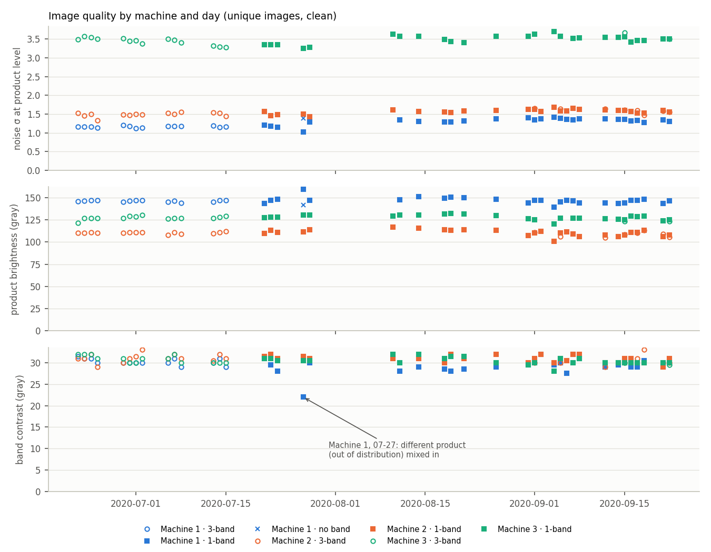 | 용어 | — |
| 94 | 제3장 · 장비·시간 요인 · 그림 캡션 · 앞: ">  | > 〔그림 3-3〕 호기·일자별 영상 품질(고유 영상 clean, 하루 3장 이상인 묶음). 위: 제품 밝기에서의 잡음 σ, 가운데: 제품 밝기, 아래: 띠 대비. 속 빈 원 = 3띠, 채운 사각형 = 1띠 제품. 세 호기 모두 기간 내내 안정적이며, 3호기는 처음부터 잡음이 1·2호기의 2배 이상(σ 약 3.5). 1호기 07-27 점(띠 대비 약 22)은 다른 제품(OOD) 세션 영상이 섞인 묶음 | C-4 | — |
| 95 | 제3장 · 결론: 미탐지 위험 조건과 대응 · 표 · 앞: "\| 3호기 × 큰 박스 \| 미검 18건 중 …" | \| 3호기 × 1띠 제품 \| 탐지는 되지만 점수가 낮음(top-1 0.645) → 사전 통과 임계값 아래로 샘 \| 통과 임계값 여유 확보, 호기·제품별 점수 척도 감시(제4장) \| | \| 3호기 × 1띠 제품 \| 탐지는 되지만 점수가 낮음(top-1 0.645) → 사전 통과 임계값 아래로 샘 \| 통과 임계값 안전 마진 확보, 호기·제품별 점수 분포 감시(제4장) \| | 용어 | — |
| 96 | 제3장 · 결론: 미탐지 위험 조건과 대응 · 표 · 앞: "\| 3호기 × 1띠 제품 \| 탐지는 되지만 …" | \| 박스 관례 \| IoU 0.7에서 recall 0.58, FP의 94%가 위치 오차 \| 영상 판정은 위치 적중 기준으로 함 \| | \| 박스 관례 \| IoU 0.7에서 recall 0.58, FP의 94%가 위치 오차 \| 영상 판정은 중심 적중 기준으로 함 \| | 용어 | — |
| 97 | 제4장 · — · 장 제목 · 앞: "\| 박스 관례 \| IoU 0.7에서 reca…" | ## 제4장. 현장 활용방안〔10점〕 | ## □ 제4장. 현장 활용방안〔10점〕 | B-1 | — |
| 98 | 제4장 · 3구간 판정 규칙 (dev에서 결정, 테스트로 조정 · 표 · 앞: "\|---\|---\|---\|…" | \| 통과 \| 영상 점수 p < t_low = **0.833**, 그리고 OOD 가드 비해당 \| t_low = min(사전 규칙 0.947, 객체 검출 임계값 0.359의 보정값 0.833) → **객체를 하나라도 검출하면 자동 통과하지 않음**(여유 규칙, 아래 검증) \| | \| 통과 \| 영상 점수 p < t_low = **0.833**, 그리고 OOD 가드 비해당 \| t_low = min(사전 규칙 0.947, 객체 검출 임계값 0.359의 보정값 0.833) → **객체를 하나라도 검출하면 자동 통과하지 않음**(마진 규칙, 아래 검증) \| | R-8, 용어 | — |
| 99 | 제4장 · 3구간 판정 규칙 (dev에서 결정, 테스트로 조정 · 표 · 앞: "\| 통과 \| 영상 점수 p < t_low =…" | \| 재검사 \| t_low ≤ p < t_high, 또는 통과 구간이지만 반전 4종 TTA 점수 표준편차 ≥ 0.1, 또는 OOD 가드 해당 \| 사람이 다시 확인. OOD 가드: 제품 면적이 dev 범위(25,923–53,744px) 밖이거나 띠가 검출되지 않는 영상 \| | \| 재검사 \| t_low ≤ p < t_high, 또는 통과 구간이지만 TTA(원본 + 반전 3종) 영상 점수의 표준편차 ≥ 0.1, 또는 OOD 가드 해당 \| 사람이 다시 확인. OOD 가드: 제품 면적이 dev 범위(25,923–53,744px) 밖이거나 띠가 검출되지 않는 영상 \| | R-4 | — |
| 100 | 제4장 · 3구간 판정 규칙 (dev에서 결정, 테스트로 조정 · 표 · 앞: "\| 재검사 \| t_low ≤ p < t_hi…" | \| 배출 \| p ≥ t_high = 0.983 \| 음성 대용(dev 400장) 중 이 점수 이상인 영상 0장 \| | \| 배출 \| p ≥ t_high = 0.983 \| 대리 음성(dev 400장) 중 이 점수 이상인 영상 0장 \| | 용어 | — |
| 101 | 제4장 · 3구간 판정 규칙 (dev에서 결정, 테스트로 조정 · - 2단계 · 앞: "\| 배출 \| p ≥ t_high = 0.98…" | - p는 **보정된 박스 확률**의 영상 내 최대값임. YOLO 원신뢰도는 보정이 크게 어긋나 있어(ECE 0.216) Platt 보정(fold 교차적합)으로 ECE 0.002로 맞춤〔그림 4-1〕 | - p는 **보정된 박스 확률**의 영상 내 최대값임. YOLO 원시 신뢰도는 보정이 크게 어긋나 있어(ECE 0.216) Platt 보정(fold 교차적합)으로 ECE 0.002로 맞춤〔그림 4-1〕 | 용어 | — |
| 102 | 제4장 · 3구간 판정 규칙 (dev에서 결정, 테스트로 조정 · 그림 위치 표시(HWPX 반영 불필요) · 앞: "- p는 **보정된 박스 확률**의 영상 내…" | > **[그림 삽입 위치]** `outputs/figures/calibration_p3_coco_v2b.png` | > **[그림 삽입 위치]** `outputs/figures_report/calibration_p3_coco_v2b.png` | R-11 | — |
| 103 | 제4장 · 3구간 판정 규칙 (dev에서 결정, 테스트로 조정 · 그림 미리보기 줄(HWPX 반영 불필요) · 앞: "> **[그림 삽입 위치]** `output…" | > 〔그림 4-1〕 (왼쪽) 박스 확률 보정의 신뢰도 곡선(dev OOF 교차적합, 10구간, 점 크기 = 박스 수): 원신뢰도(회색)는 0.57–0.72인데 실제 TP 비율은 약 0.98로 크게 과소 추정 → Platt 보정(파랑) 후 대각선에 일치. (오른쪽) 3구간 경계(보정 확률, 0.75–1 확대): 파랑 = 1객체 양성 영상의 위치 적중 recall, 주황 = 음성 대용 표시 비율, 배경색 = 통과·재검사·배출. 현행 t_low 0.833, 사전 t_low 0.947, t_high 0.983 | > 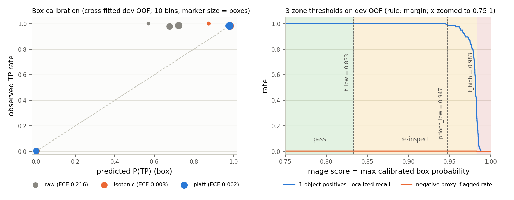 | 용어 | — |
| 104 | 제4장 · 3구간 판정 규칙 (dev에서 결정, 테스트로 조정 · 그림 캡션 · 앞: ">  | > 〔그림 4-1〕 (왼쪽) 박스 확률 보정의 신뢰도 곡선(dev OOF 교차적합, 10구간, 점 크기 = 박스 수): 원시 신뢰도(회색)는 0.57–0.72인데 실제 TP 비율은 약 0.98로 크게 과소 추정 → Platt 보정(파랑) 후 대각선에 일치. (오른쪽) 3구간 경계(보정 확률, 0.75–1 확대): 파랑 = 1객체 양성 영상의 중심 적중 recall, 주황 = 대리 음성의 재검사 이상 비율, 배경색 = 통과·재검사·배출. 현행 t_low 0.833, 사전 t_low 0.947, t_high 0.983 | 용어 | — |
| 105 | 제4장 · 3구간 판정 규칙 (dev에서 결정, 테스트로 조정 · - 2단계 · 앞: "> 〔그림 4-1〕 (왼쪽) 박스 확률 보정…" | - 사전 규칙(t_low 0.947 = 1객체 영상 위치 적중 recall ≥ 0.99를 만족하는 가장 큰 값)은 동결 테스트에서 이식에 실패해(아래) 여유 규칙으로 바꿈. 변경 근거와 시점은 `docs/decisions.md`에 기록함 | - 사전 규칙(t_low 0.947 = 1객체 영상 중심 적중 recall ≥ 0.99를 만족하는 가장 큰 값)은 동결 테스트에서 이식에 실패해(아래) 마진 규칙으로 바꿈. 변경 근거와 시점은 `docs/decisions.md`에 기록함 | 용어 | — |
| 106 | 제4장 · 3구간 판정 규칙 (dev에서 결정, 테스트로 조정 · - 2단계 · 앞: "- 사전 규칙(t_low 0.947 = 1객…" | - TTA 불확실성 규칙은 dev에서 사전 t_low 미만으로 놓친 객체 20개 중 7개(35%)를 회수했으나, 점수 척도가 통째로 낮아지는 경우(아래 3호기 1띠)는 잡지 못함(테스트 통과 9장의 표준편차 0.005–0.05) | - TTA 불확실성 규칙: 사전 규칙에서는 점수가 사전 t_low(0.947)보다 낮은 객체 20개(IoU 0.5 매칭 점수 기준 — 매칭 실패 17개, 낮은 점수 3개) 중 7개가 원본 + 반전 3종 보기 간 표준편차 ≥ 0.1이라 재검사로 회수됨(대리 음성 추가 재검사 0.5%). 현행 마진 규칙에서는 dev 1객체 영상 통과가 이미 0%라 dev에서의 추가 효과는 없으며(대리 음성 추가 재검사 ≤ 0.5%), 안전 장치로 유지함. 점수 분포 전체가 낮게 이동하는 경우(아래 3호기 1띠)는 잡지 못함(테스트 통과 9장의 표준편차 0.005–0.05) | R-3 | — |
| 107 | 제4장 · 재검사 비율과 미검 위험의 트레이드오프 · 표 · 앞: "◦ **재검사 비율과 미검 위험의 트레이드오…" | \| 유병률 \| 1만 개당 미검(사전 규칙) \| 1만 개당 미검(여유 규칙) \| 재검사 비율 \| 자동 배출 비율 \| 경보 정밀도 \| | \| 이물 혼입률 \| 1만 개당 미검(사전 규칙) \| 1만 개당 미검(마진 규칙) \| 재검사 비율 \| 자동 배출 비율 \| 경보 정밀도 \| | 용어 | — |
| 108 | 제4장 · 재검사 비율과 미검 위험의 트레이드오프 · * 3단계 · 앞: "\| 10% \| 104 \| 26 \| 7.8% …" | * 미검 = 1만 × 유병률 × 1객체 통과 누수율. 누수율은 dev 안 시뮬레이션(중첩 학습, 배포 이동 포함)의 값(사전 12/115 = 10.4%, 여유 3/115 = 2.6%)을 씀 — dev OOF 그대로(사전 0.9%, 여유 0%)보다 보수적인 추정. 재검사·배출·정밀도는 dev OOF 음성 대용과 1객체 양성 영상 기준이며, 두 규칙의 차이는 0.01%p 이내임 | * 미검 = 1만 × 이물 혼입률 × 1객체 통과 미검률. 통과 미검률은 dev 안 시뮬레이션(중첩 학습, 배포 모델 이동 포함)의 값(사전 12/115 = 10.4%, 마진 3/115 = 2.6%)을 씀 — dev OOF 그대로(사전 0.9%, 마진 0%)보다 보수적인 추정. 재검사·배출·정밀도는 dev OOF 대리 음성과 1객체 양성 영상 기준이며, 두 규칙의 차이는 0.01%p 이내임 | #25, 용어 | — |
| 109 | 제4장 · 재검사 비율과 미검 위험의 트레이드오프 · * 3단계 · 앞: "* 미검 = 1만 × 이물 혼입률 × 1객체…" | - dev OOF 1객체 양성 영상의 판정 분포: 통과 0% / 재검사 75.7% / 배출 24.3%. 음성 대용: 통과 99.8% / 재검사 0.2% / 배출 0%〔그림 4-2〕 | * 이물 혼입률 = AI 판정기에 들어오는 영상(장비 NG 영상) 중 실제 이물이 있는 영상의 비율. 양성은 1객체 영상, 음성은 대리 음성 분포로 가정함 | #25 | — |
| 110 | 제4장 · 재검사 비율과 미검 위험의 트레이드오프 · - 2단계 · 앞: "* 이물 혼입률 = AI 판정기에 들어오는 …" | > **[그림 삽입 위치]** `outputs/figures/report_zones.png` | - dev OOF 1객체 양성 영상의 판정 분포: 통과 0% / 재검사 75.7% / 배출 24.3%. 대리 음성: 통과 99.75% / 재검사 0.25% / 배출 0%〔그림 4-2〕 | #32 | — |
| 111 | 제4장 · 재검사 비율과 미검 위험의 트레이드오프 · 그림 위치 표시(HWPX 반영 불필요) · 앞: "- dev OOF 1객체 양성 영상의 판정 …" | (없음 — 새 줄 추가) | > **[그림 삽입 위치]** `outputs/figures_report/report_zones.png` | R-11 | — |
| 112 | 제4장 · 재검사 비율과 미검 위험의 트레이드오프 · 그림 미리보기 줄(HWPX 반영 불필요) · 앞: "> **[그림 삽입 위치]** `output…" | > 〔그림 4-2〕 모델별 3구간 판정 분포(dev OOF). 양성 = 1객체 영상, 음성 대용 = 정답 주변을 뺀 배경의 최고 점수. 최종모델은 여유 규칙 적용(통과 0% / 재검사 76% / 배출 24%), 나머지 모델은 각자의 사전 규칙 | > 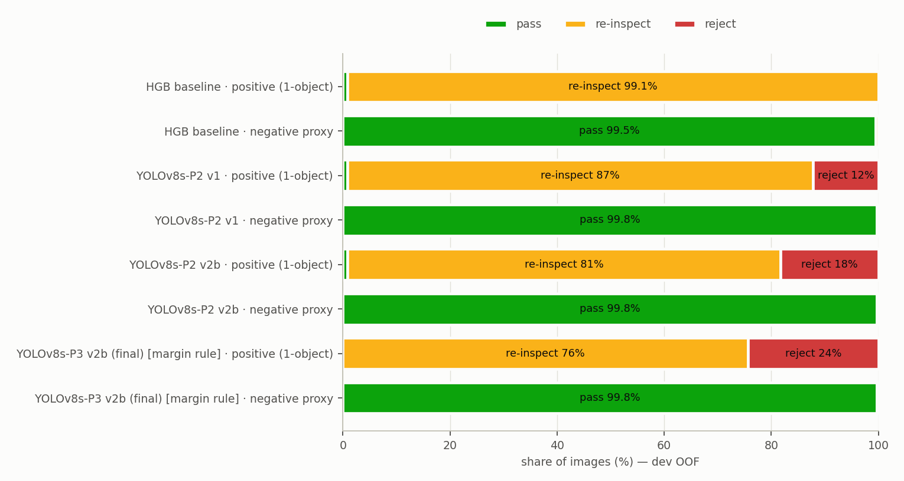 | 용어 | — |
| 113 | 제4장 · 재검사 비율과 미검 위험의 트레이드오프 · 그림 캡션 · 앞: ">  | > 〔그림 4-2〕 모델별 3구간 판정 분포(dev OOF). 양성 = 1객체 영상, 대리 음성 = 정답 주변을 뺀 배경의 최고 점수. 최종모델은 마진 규칙 적용(통과 0% / 재검사 76% / 배출 24%), 나머지 모델은 각자의 사전 규칙. 그림의 백분율은 반올림 값(대리 음성 통과 99.75% → 99.8%) | R-9, 용어 | — |
| 114 | 제4장 · 재검사 비율과 미검 위험의 트레이드오프 · - 2단계 · 앞: "> 〔그림 4-2〕 모델별 3구간 판정 분포…" | - 해석: 장비가 NG로 판정한 영상 중 이물이 확실한 약 1/4은 사람 확인 없이 바로 배출하고, 나머지 의심 영상만 재검사함. 음성 대용 기준으로 장비 과검(실제 양품)은 99.8%가 통과로 판정되어 이중·삼중 검사 물량을 줄일 수 있음(실제 OK 영상으로 검증 필요) | - 해석: 장비가 NG로 판정한 영상 중 이물이 확실한 약 1/4은 사람 확인 없이 바로 배출하고, 나머지 의심 영상만 재검사함. 대리 음성 기준으로 장비 과검(실제 양품)은 99.75%가 통과로 판정되어 이중·삼중 검사 물량을 줄일 수 있음(실제 OK 영상으로 검증 필요) | #32 | — |
| 115 | 제4장 · 통과 임계값 이식 실패 — 원인 진단과 dev 검증 · - 2단계 · 앞: "◦ **통과 임계값 이식 실패 — 원인 진단…" | - 결과(사전 규칙 그대로, 동결 테스트 1회 평가): 1객체 양성 영상 61장 중 **9장(14.8%)이 통과 구간**에 들어감. 9장 모두 **3호기 1띠 제품**(08-14·18·21)이며, 객체 자체는 검출됨(원점수 0.45–0.54, 객체 임계값 0.359 이상) → 탐지 실패가 아니라 **통과 임계값 문제** | - 결과(사전 규칙 그대로, 동결 테스트 1회 평가): 1객체 양성 영상 61장 중 **9장(14.8%)이 통과 구간**에 들어감. 9장 모두 **3호기 1띠 제품**(08-14·18·21)이며, 객체 자체는 검출됨(원시 점수(raw score) 0.45–0.54, 객체 임계값 0.359 이상) → 탐지 실패가 아니라 **통과 임계값 문제** | 용어 | — |
| 116 | 제4장 · 통과 임계값 이식 실패 — 원인 진단과 dev 검증 · - 2단계 · 앞: "- 결과(사전 규칙 그대로, 동결 테스트 1…" | - 원인 ① 규칙의 여유 0: 'recall 0.99를 만족하는 가장 큰 임계값'은 정의상 양성 분포의 아래 끝(원점수 0.554)에 붙음. 반면 음성 대용 점수는 p99 0.028로 훨씬 아래에 있어, 0.1–0.5 사이의 넓은 빈 구간을 쓰지 못함〔그림 4-3〕 | - 원인 ① 규칙의 안전 마진 0: ‘recall 0.99를 만족하는 가장 큰 임계값’은 정의상 양성 분포의 아래 끝(원시 점수 0.554)에 붙음. 반면 대리 음성 점수는 p99 0.028로 훨씬 아래에 있어, 0.1–0.5 사이의 넓은 빈 구간을 쓰지 못함〔그림 4-3〕 | 용어 | — |
| 117 | 제4장 · 통과 임계값 이식 실패 — 원인 진단과 dev 검증 · - 2단계 · 앞: "- 원인 ① 규칙의 안전 마진 0: ‘rec…" | - 원인 ② 3호기 1띠 제품의 점수 척도 하락(제3장): 이물 대비는 같지만 top-1 점수가 낮음 | - 원인 ② 3호기 1띠 제품의 점수 분포 하향 이동(제3장): 이물 대비는 같지만 top-1 점수가 낮음 | 용어 | — |
| 118 | 제4장 · 통과 임계값 이식 실패 — 원인 진단과 dev 검증 · - 2단계 · 앞: "- 원인 ② 3호기 1띠 제품의 점수 분포 …" | - 원인 ③ 배포 모델 이동: dev 전체로 다시 학습한 모델이 3호기 1띠에서 점수를 더 낮게 냄 | - 원인 ③ 배포 모델 이동(deployment shift): dev 전체로 다시 학습한 모델이 3호기 1띠에서 점수를 더 낮게 냄 | 용어 | — |
| 119 | 제4장 · 통과 임계값 이식 실패 — 원인 진단과 dev 검증 · 그림 위치 표시(HWPX 반영 불필요) · 앞: "* 미라벨 2,032장(테스트 미사용)에서 …" | > **[그림 삽입 위치]** `outputs/figures/threshold_tradeoff_p3_coco_v2b.png` | > **[그림 삽입 위치]** `outputs/figures_report/threshold_tradeoff_p3_coco_v2b.png` | R-11 | — |
| 120 | 제4장 · 통과 임계값 이식 실패 — 원인 진단과 dev 검증 · 그림 미리보기 줄(HWPX 반영 불필요) · 앞: "> **[그림 삽입 위치]** `output…" | > 〔그림 4-3〕 통과 임계값 위치별 미검 누수와 재검사 비용(dev OOF, 원점수 로그 축). 파랑 = 통과로 샌 1객체 양성 영상 비율(초록 점선 = 3호기), 주황 = 재검사로 보내지는 음성 대용 비율. 음영 = 시뮬레이션 분할별로 각 규칙이 고른 임계값 범위(빨강 R0, 초록 R4), 점선 = 사전 t_low(원점수 0.554)와 최종 t_low(여유 규칙, 0.359). 0.1–0.5 구간은 비용이 거의 평평해 양성 쪽 여유를 둘 수 있음 | > 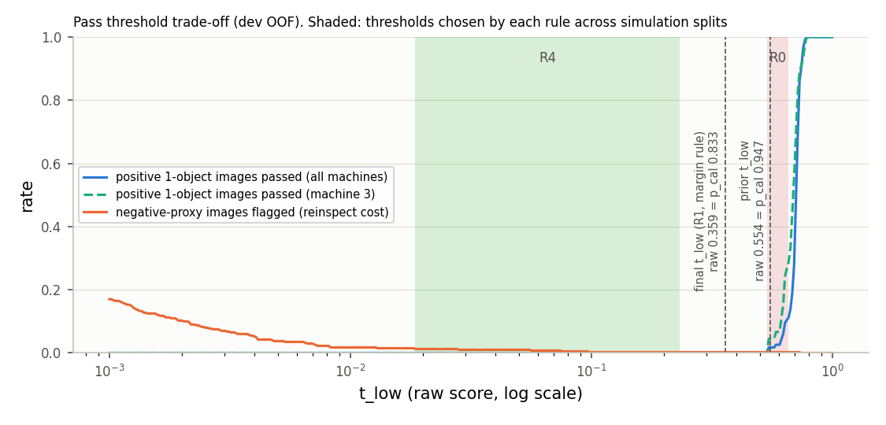 | 용어 | — |
| 121 | 제4장 · 통과 임계값 이식 실패 — 원인 진단과 dev 검증 · 그림 캡션 · 앞: ">  | > 〔그림 4-3〕 통과 임계값 위치별 통과 미검과 재검사 비용(dev OOF, 원시 점수 로그 축). 파랑 = 통과로 판정된 1객체 양성 영상 비율(초록 점선 = 3호기), 주황 = 재검사로 보내지는 대리 음성 비율. 음영 = 시뮬레이션 분할별로 각 규칙이 고른 임계값 범위(빨강 R0, 초록 R4), 점선 = 사전 t_low(원시 점수 0.554 = 보정 확률 0.947)와 최종 t_low(마진 규칙 R1, 원시 점수 0.359 = 보정 확률 0.833). R1의 분할별 임계값은 원시 점수 0.10–0.62로 넓게 흩어져 음영으로 표시하지 않음. 0.1–0.5 구간은 비용이 거의 평평해 양성 쪽 안전 마진을 둘 수 있음 | C-6, 용어 | — |
| 122 | 제4장 · 통과 임계값 이식 실패 — 원인 진단과 dev 검증 · * 3단계 · 앞: "- dev 안 재현과 규칙 비교: 테스트를 …" | * LOFO: fold 하나를 빼고 나머지 OOF로 규칙을 정해 뺀 fold에 적용 → 날짜·집단 이동 반영 | * LOFO: fold 하나를 빼고 나머지 OOF로 규칙을 정해 뺀 fold에 적용 → 날짜·모집단 분포 이동(population shift) 반영 | 용어 | — |
| 123 | 제4장 · 통과 임계값 이식 실패 — 원인 진단과 dev 검증 · * 3단계 · 앞: "* LOFO: fold 하나를 빼고 나머지 …" | * 중첩 학습: 2개 fold로 학습한 안쪽 모델(6개 추가 학습)의 OOF로 규칙을 정하고, 3개 fold로 학습한 모델에 적용 → 실제 절차(fold 모델 → 전체 재학습 모델)와 같은 배포 이동까지 반영 | * 중첩 학습: 2개 fold로 학습한 안쪽 모델(6개 추가 학습)의 OOF로 규칙을 정하고, 3개 fold로 학습한 모델에 적용 → 실제 절차(fold 모델 → 전체 재학습 모델)와 같은 배포 모델 이동까지 반영. 1객체 영상이 fold 2·3에만 있어 바깥 fold 2·3만 수행해도 1객체 115장 전부를 다룸(대리 음성 분모는 LOFO 400장, 중첩 188장) | #27 | — |
| 124 | 제4장 · 통과 임계값 이식 실패 — 원인 진단과 dev 검증 · * 3단계 · 앞: "* 중첩 학습: 2개 fold로 학습한 안쪽…" | * 선택 기준: 두 모드 모두 음성 대용 재검사 비율 ≤ 1%인 규칙 중 1객체 통과 누수가 가장 적은 규칙 | * 선택 기준: 두 모드 모두 대리 음성 재검사 비율 ≤ 1%인 규칙 중 1객체 통과 미검이 가장 적은 규칙 | 용어 | — |
| 125 | 제4장 · 통과 임계값 이식 실패 — 원인 진단과 dev 검증 · 표 · 앞: "* 선택 기준: 두 모드 모두 대리 음성 재…" | \| 규칙 \| LOFO 누수(1객체 115장) \| 중첩 누수 \| 음성 대용 비용(LOFO / 중첩) \| 판정 \| | \| 규칙 \| LOFO 통과 미검(1객체 115장) \| 중첩 통과 미검 \| 대리 음성 비용(LOFO / 중첩) \| 판정 \| | 용어 | — |
| 126 | 제4장 · 통과 임계값 이식 실패 — 원인 진단과 dev 검증 · 표 · 앞: "\| R0 사전(recall 0.99 최대값)…" | \| **R1 여유: min(R0, 객체 검출 임계값)** \| 2 \| **3** \| 0.25% / 0% \| **선택** \| | \| **R1 마진: min(R0, 객체 검출 임계값)** \| 2 \| **3** \| 0.25% / 0% \| **선택** \| | 용어 | — |
| 127 | 제4장 · 통과 임계값 이식 실패 — 원인 진단과 dev 검증 · 표 · 앞: "\| R3 부트스트랩 5% 분위수 \| 2 \| …" | \| R4 비용 상한(음성 대용 ≤ 0.5%의 최소 t) \| 0 \| 0 \| **1.25%** / 0% \| 비용 기준 초과 \| | \| R4 비용 상한(대리 음성 ≤ 0.5%의 최소 t) \| 0 \| 0 \| **1.25%** / 0% \| 비용 기준 초과 \| | 용어 | — |
| 128 | 제4장 · 통과 임계값 이식 실패 — 원인 진단과 dev 검증 · * 3단계 · 앞: "* 중첩 학습은 테스트 실패를 dev에서 재…" | * R1은 누수를 1/4로 줄이지만 0으로 만들지는 못함(중첩 3/115, 단측 95% 상한 6.6%). 시뮬레이션 안에서는 기준 임계값(안쪽 F1 최적값)이 0.10–0.62로 흔들려 여유가 일정하지 않았음 → 최종 규칙은 dev 전체 OOF로 정한 고정값 0.359를 씀 | * R1은 통과 미검을 1/4로 줄이지만 0으로 만들지는 못함(중첩 3/115, 단측 95% 상한(Clopper–Pearson) 6.6%). 시뮬레이션 안에서는 기준 임계값(안쪽 F1 최적값)이 0.10–0.62로 흔들려 마진이 일정하지 않았음 → 최종 규칙은 dev 전체 OOF로 정한 고정값 0.359를 씀 | #1 | — |
| 129 | 제4장 · 통과 임계값 이식 실패 — 원인 진단과 dev 검증 · * 3단계 · 앞: "* R1은 통과 미검을 1/4로 줄이지만 0…" | * R4는 R0–R3의 LOFO 결과를 본 뒤 중첩 결과가 나오기 전에 추가한 후보임. 두 모드 모두 누수 0이지만 LOFO 비용이 1.25%(400장 중 5장)로 사전 기준(1%)을 넘음 → 기준을 바꾸지 않고 선택하지 않음. **재검사 여력이 있는 현장의 대안 운영점**으로 제시함 | * R4는 R0–R3의 LOFO 결과를 본 뒤 중첩 결과가 나오기 전에 추가한 후보임. 두 모드 모두 통과 미검 0이지만 LOFO 비용이 1.25%(400장 중 5장)로 사전 기준(1%)을 넘음 → 기준을 바꾸지 않고 선택하지 않음. **재검사 여력이 있는 현장의 대안 운영점**으로 제시함 | 용어 | — |
| 130 | 제4장 · 통과 임계값 이식 실패 — 원인 진단과 dev 검증 · - 2단계 · 앞: "* R4는 R0–R3의 LOFO 결과를 본 …" | - 사후 확인(테스트, 규칙 설계 전에 결과를 본 데이터이므로 독립 검증 아님): 여유 규칙과 OOD 가드를 적용하면 1객체 통과 9/61 → **0/61**, 전체 판정 재검사 65% / 배출 35%, 음성 대용 비용 0%. 예측 파일에는 사전 규칙(`zone_prior`, 1회 평가 기록)과 현행 규칙(`zone`)을 함께 둠 | - 사후 분석(post-hoc, 테스트: 규칙 설계 전에 결과를 본 데이터이므로 독립 검증 아님): 마진 규칙과 OOD 가드를 적용하면 1객체 통과 9/61 → **0/61**, 전체 판정 재검사 65% / 배출 35%, 대리 음성 비용 0%. 예측 파일에는 사전 규칙(`zone_prior`, 1회 평가 기록)과 현행 규칙(`zone`)을 함께 둠 | 용어 | — |
| 131 | 제4장 · 통과 임계값 이식 실패 — 원인 진단과 dev 검증 · * 3단계 · 앞: "* 규칙 변경은 테스트 실패를 본 뒤 설계했…" | * 모델을 다시 학습하면 보정·임계값도 그 모델에 맞춰 다시 정함(보정 전용 데이터 분리). 4시간 주기 시험편 세션에서 호기·제품 유형별 top-1 점수를 확인해 척도 이동을 감시함(아래 모니터링) | * 모델을 다시 학습하면 보정·임계값도 그 모델에 맞춰 다시 정함(보정 전용 데이터 분리). 4시간 주기 시험편 세션에서 호기·제품 유형별 top-1 점수를 확인해 점수 분포 이동을 감시함(아래 모니터링) | 용어 | — |
| 132 | 제4장 · 실시간 적용 구조 · - 2단계 · 앞: "- 구성: 장비 SD 카드 → 수집 모듈(파…" | - 처리 시간(batch 1, 100장 평균): 표시 제거 전처리 13.6ms + 탐지 13.0ms(RTX 3070) = **약 27ms/장** → 현장 참고 수준(0.02–0.03초/장) 안에 들어옴. CPU만 쓰면 탐지 100ms/장(베이스라인 HGB 48ms/장) | - 처리 시간(batch 1, 100장 평균): 표시 제거 전처리 13.6ms + 탐지 13.0ms(RTX 3070) = **약 27ms/장** → 데이터셋 가이드북에 보고된 처리 속도(0.02–0.03초/장, RTX 2060)와 같은 수준. CPU만 쓰면 탐지 100ms/장(베이스라인 HGB 48ms/장) | #30 | — |
| 133 | 제4장 · 실시간 적용 구조 · - 2단계 · 앞: "- 처리 시간(batch 1, 100장 평균…" | (없음 — 새 줄 추가) | - 통과 후보 영상(영상 점수 < t_low)은 TTA(원본 + 반전 3종) 확인을 위해 반전 3종을 추가로 추론하므로 약 35ms가 더 걸림(batch 1, 100장 평균, 합계 약 62ms/장) | #31, R-4 | — |
| 134 | 제4장 · 장비 감도 점검 로그 활용 (조기경보 제안) · - 2단계 · 앞: "- 영상의 약 90%가 4시간 주기 시험편 …" | - 미라벨 2,032장(장비 NG 영상) 추론 결과: 사전 규칙 배출 715장(35.2%) / 재검사 1,169장(57.5%) / 통과 148장(7.3%) → 현행 규칙(여유 규칙 + OOD 가드) 배출 715장(35.2%) / 재검사 1,317장(64.8%) / 통과 0장 | - 미라벨 2,032장(장비 NG 영상) 추론 결과: 사전 규칙 배출 715장(35.2%) / 재검사 1,169장(57.5%) / 통과 148장(7.3%) → 현행 규칙(마진 규칙 + OOD 가드) 배출 715장(35.2%) / 재검사 1,317장(64.8%) / 통과 0장 | 용어 | — |
| 135 | 제4장 · 장비 감도 점검 로그 활용 (조기경보 제안) · * 3단계 · 앞: "* 모델 점수: **3호기가 1띠 제품으로 …" | * 그 결과 사전 규칙에서 3호기 1띠 영상의 12.4%(43/347장)가 '통과'로 판정됨. 이 영상들은 모두 객체 검출 임계값(0.359) 이상의 박스가 정확히 1개 있음 → **탐지 실패가 아니라 통과 임계값 문제**(동결 테스트 실패와 같은 기전) | * 그 결과 사전 규칙에서 3호기 1띠 영상의 12.4%(43/347장)가 ‘통과’로 판정됨. 이 영상들은 모두 객체 검출 임계값(0.359) 이상의 박스가 정확히 1개 있음 → **탐지 실패가 아니라 통과 임계값 문제**(동결 테스트 실패와 같은 기전) | 용어 | — |
| 136 | 제4장 · 장비 감도 점검 로그 활용 (조기경보 제안) · * 3단계 · 앞: "* 그 결과 사전 규칙에서 3호기 1띠 영상…" | * 사전 규칙 통과 영상 감사〔그림 4-5〕: 3호기 44장 모두 띠 끝의 뚜렷한 점을 찾았음(육안). 최고 점수 박스의 띠 끝 거리 중앙값 11px(dev 정답 3호기 14.6px). [분석 전용 대조] 최고 점수 박스가 장비 표시 안에 있는 비율 100% — 판정·임계값·학습에는 쓰지 않음 | * 사전 규칙 통과 영상 감사〔그림 4-5〕: 3호기 44장(1띠 43장 + 3띠 1장) 모두 띠 끝의 뚜렷한 점을 찾았음(육안). 최고 점수 박스의 띠 끝 거리 중앙값 11px(dev 정답 3호기 14.6px). [분석 전용 대조] 최고 점수 박스가 장비 표시 안에 있는 비율 100% — 판정·임계값·학습에는 쓰지 않음 | #28 | — |
| 137 | 제4장 · 장비 감도 점검 로그 활용 (조기경보 제안) · * 3단계 · 앞: "* 사전 규칙 통과 영상 감사〔그림 4-5〕…" | * 정정: 이전 판의 '3호기 검출 여유 급락(08-14, 09-21)'은 영상마다 상위 3개 박스를 섞어 집계한 착시였음(1띠 제품에서는 2·3번째 박스가 배경) | * 정정: 이전 판의 ‘3호기 검출 마진 급락(08-14, 09-21)’은 영상마다 상위 3개 박스를 섞어 집계한 착시였음(1띠 제품에서는 2·3번째 박스가 배경) | 용어 | — |
| 138 | 제4장 · 장비 감도 점검 로그 활용 (조기경보 제안) · 그림 위치 표시(HWPX 반영 불필요) · 앞: "* 정정: 이전 판의 ‘3호기 검출 마진 급…" | > **[그림 삽입 위치]** `outputs/figures/monitoring_trend.png` | > **[그림 삽입 위치]** `outputs/figures_report/monitoring_trend.png` | R-11 | — |
| 139 | 제4장 · 장비 감도 점검 로그 활용 (조기경보 제안) · 그림 미리보기 줄(HWPX 반영 불필요) · 앞: "> **[그림 삽입 위치]** `output…" | > 〔그림 4-4〕 미라벨 2,032장의 호기·제품 유형·일자별 추세(영상당 최고 점수 박스, 하루 3장 이상인 묶음). 위: 이물 대비(코어 깊이) — 안정. 가운데: 모델 점수 — 3호기 1띠(초록 사각형)만 낮음. 아래: 사전 규칙의 '통과' 비율 — 3호기 1띠 시기와 1호기 07-27 OOD 세션에서 상승(현행 규칙에서는 모든 날 0%) | > 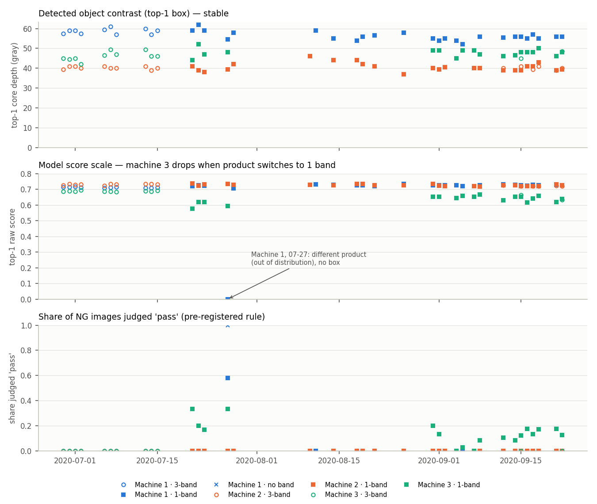 | 용어 | — |
| 140 | 제4장 · 장비 감도 점검 로그 활용 (조기경보 제안) · 그림 캡션 · 앞: ">  | > 〔그림 4-4〕 미라벨 2,032장의 호기·제품 유형·일자별 추세(영상당 최고 점수 박스, 하루 3장 이상인 묶음). 위: 이물 대비(코어 깊이) — 안정. 가운데: 모델 점수 — 3호기 1띠(초록 사각형)만 낮음. 아래: 사전 규칙의 ‘통과’ 비율 — 3호기 1띠 시기와 1호기 07-27 OOD 세션에서 상승(현행 규칙에서는 모든 날 0%). 가운데 패널의 1호기 07-27 점(점수 0)은 예측 박스가 없는 OOD 세션 | — | — |
| 141 | 제4장 · 장비 감도 점검 로그 활용 (조기경보 제안) · 그림 위치 표시(HWPX 반영 불필요) · 앞: "> 〔그림 4-4〕 미라벨 2,032장의 호…" | > **[그림 삽입 위치]** `outputs/figures/audit_m3_pass.png` | > **[그림 삽입 위치]** `outputs/figures_report/audit_m3_pass.png` | R-11 | — |
| 142 | 제4장 · 장비 감도 점검 로그 활용 (조기경보 제안) · 그림 미리보기 줄(HWPX 반영 불필요) · 앞: "> **[그림 삽입 위치]** `output…" | > 〔그림 4-5〕 사전 규칙에서 '통과'로 판정된 3호기 NG 영상 44장 전부(clean 영상 확대, 빨강 = AI 최고 점수 박스, 숫자 = 날짜·원점수). 모두 띠 끝의 뚜렷한 점을 찾았으나 원점수(0.42–0.55)가 사전 통과 임계값(0.554) 아래였음 → 탐지 실패가 아닌 임계값 문제 | > 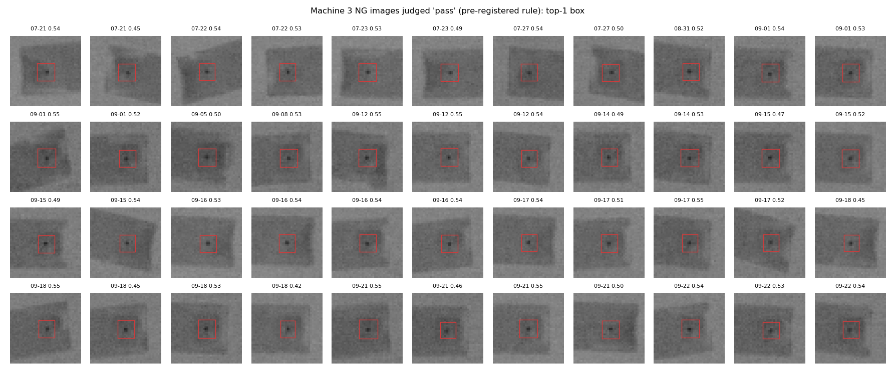 | 용어 | — |
| 143 | 제4장 · 장비 감도 점검 로그 활용 (조기경보 제안) · 그림 캡션 · 앞: ">  | > 〔그림 4-5〕 사전 규칙에서 ‘통과’로 판정된 3호기 NG 영상 44장 전부(clean 영상 확대, 빨강 = AI 최고 점수 박스, 숫자 = 날짜·원시 점수). 모두 띠 끝의 뚜렷한 점을 찾았으나 원시 점수(0.42–0.55)가 사전 통과 임계값(0.554) 아래였음 → 탐지 실패가 아닌 임계값 문제 | 용어 | — |
| 144 | 제4장 · 장비 감도 점검 로그 활용 (조기경보 제안) · - 2단계 · 앞: "> 〔그림 4-5〕 사전 규칙에서 ‘통과’로…" | - 학습 분포 밖(OOD) 세션: 1호기 07-27(412×332) 영상 중 **띠가 없는 다른 제품(용기형, 화면에 일부만 촬영) 93장**은 예측 박스가 거의 없어 전부 '통과'로 판정됨. 미라벨 '통과' 148장 중 104장이 이 세션임〔그림 4-6〕 | - 학습 분포 밖(OOD) 세션: 1호기 07-27(412×332) 세션의 **다른 제품(용기형, 화면에 일부만 촬영) 영상 104장**(띠 없음 93장, 띠가 1줄로 잘못 검출된 11장)은 예측 박스가 거의 없어 전부 ‘통과’로 판정됨. 미라벨 ‘통과’ 148장 중 104장이 이 세션임〔그림 4-6〕 | #29 | — |
| 145 | 제4장 · 장비 감도 점검 로그 활용 (조기경보 제안) · 그림 위치 표시(HWPX 반영 불필요) · 앞: "* [분석 전용 대조] 이 104장의 장비 …" | > **[그림 삽입 위치]** `outputs/figures/audit_m1_ood.png` | > **[그림 삽입 위치]** `outputs/figures_report/audit_m1_ood.png` | R-11 | — |
| 146 | 제4장 · 장비 감도 점검 로그 활용 (조기경보 제안) · 그림 미리보기 줄(HWPX 반영 불필요) · 앞: "> **[그림 삽입 위치]** `output…" | > 〔그림 4-6〕 1호기 07-27 세션의 띠 없는 영상(93장 중 44장, 전체 영상). 학습에 없던 용기형 제품이 화면에 일부만 들어오거나 제품이 없음 → 현행 규칙에서는 OOD 가드로 재검사 | > 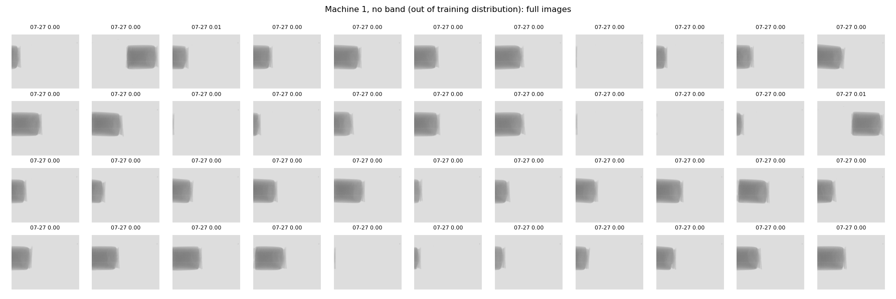 | 용어 | — |
| 147 | 제4장 · 장비 감도 점검 로그 활용 (조기경보 제안) · 그림 캡션 · 앞: ">  | > 〔그림 4-6〕 1호기 07-27 세션의 띠 없는 영상(띠 없음 93장 중 44장, 전체 영상). 학습에 없던 용기형 제품이 화면에 일부만 들어오거나 제품이 없음 → 현행 규칙에서는 OOD 가드로 재검사 | #29 | — |
| 148 | 제5장 · — · 표 · 앞: "\|---\|---\|…" | \| **팔레트 기반 정확 검출 + 후광 발견** \| 채널 임계값 없이 손실 없이 표시를 찾고, 테두리 바깥 약 3px의 후광을 실측해 '테두리만 지우면 흔적이 남는다'는 사실을 정량화함 → 2px 팽창 근거(제1장) \| | \| **팔레트 기반 정확 검출 + 후광 발견** \| 채널 임계값 없이 손실 없이 표시를 찾고, 테두리 바깥 약 3px의 후광을 실측해 ‘테두리만 지우면 흔적이 남는다’는 사실을 정량화함 → 2px 팽창 근거(제1장) \| | 용어 | — |
| 149 | 제5장 · — · 표 · 앞: "\| **팔레트 기반 정확 검출 + 후광 발견…" | \| **흔적-이물 독립화 학습** \| 가짜 표시(흔적 O·이물 X), 투과율 이식(이물 O·흔적 X), 흔적 음성(실제 흔적 O·이물 X)을 짝으로 넣음. 같은 측정 방식(HGB, 박스 안쪽만 삭제)에서 이물 삭제 자리 발화율: 전처리만 5–40% → 가짜 표시·이식 13.2% → 흔적 음성 추가 0.2%. F1은 0.974 → 0.980 → 0.979로 유지·개선 \| | \| **흔적-이물 탈상관 학습** \| 모조 표시(흔적 O·이물 X), 투과율 이식(이물 O·흔적 X), 흔적 음성 샘플(실제 흔적 O·이물 X)을 짝으로 넣음. 같은 측정 방식(HGB, 박스 안쪽만 삭제)에서 이물 삭제 위치 오검출률: 전처리만 5–40% → 모조 표시·이식 13.2% → 흔적 음성 샘플 추가 0.2%. F1은 0.974 → 0.980 → 0.979로 유지(HGB, ablation 평가 영상 기준이라 제2장 M0 0.986과 측정 조건이 다름, 흔적 음성 샘플은 5×5 삭제판) \| | #34, 용어 | — |
| 150 | 제5장 · — · 표 · 앞: "\| **흔적-이물 탈상관 학습** \| 모조 …" | \| **사전 고정 기준의 지름길 반증 묶음(T1–T8)** \| 표시 없는 영상이 하나도 없어 '표시 유무 비교'를 할 수 없는 상황을 대체함. T1 불합격도 그대로 보고하고 구조 교락으로 진단함. T7로 모델이 코어를 본다는 직접 증거를 얻음(제2장) \| | \| **사전 고정 기준의 누수 반증 시험 묶음(T1–T8)** \| 표시 없는 영상이 하나도 없어 ‘표시 유무 비교’를 할 수 없는 상황을 대체함. T1 불합격도 그대로 보고하고 구조 교락으로 진단함. T7로 모델이 코어를 본다는 직접 증거를 얻음(제2장) \| | #13 | — |
| 151 | 제5장 · — · 표 · 앞: "\| **사전 고정 기준의 누수 반증 시험 묶…" | \| **표시만 쓰는 탐지기와 원본 학습 대조군** \| 영상을 보지 않고 F1 0.94, 원본 학습 모델은 표시를 지우면 AP50 0.974 → 0.699 → '높은 점수 ≠ 이물 학습'을 수치로 보임 \| | \| **표시만 쓰는 탐지기와 원본 학습 대조군** \| 영상을 보지 않고 F1 0.94, 원본 학습 모델은 표시를 지우면 AP50 0.974 → 0.699 → ‘높은 점수 ≠ 이물 학습’을 수치로 보임 \| | 용어 | — |
| 152 | 제5장 · — · 표 · 앞: "\| **표시만 쓰는 탐지기와 원본 학습 대조…" | \| **음성 0장 상황의 음성 대용** \| 같은 제품 배경의 실제 픽셀(bg_max)로 이미지 FP율을 추정하고 유병률별 운영표로 환산함(제4장) \| | \| **음성 0장 상황의 대리 음성** \| 같은 제품 배경의 실제 픽셀(bg_max)로 이미지 FP율을 추정하고 이물 혼입률별 운영표로 환산함(제4장) \| | 용어 | — |
| 153 | 제5장 · — · 표 · 앞: "\| **음성 0장 상황의 대리 음성** \| …" | \| **통제 스트레스 시험** \| 실제 라벨이 '띠 끝의 고대비 점'뿐이라 불가능했던 조건 분석을 투과율 감쇠 × 위치 이식으로 가능하게 함. 탐지 한계(α ≈ 0.45)와 띠 끝 취약성을 도출함(제3장) \| | \| **통제 스트레스 시험** \| 실제 라벨이 ‘띠 끝의 고대비 점’뿐이라 불가능했던 조건 분석을 투과율 감쇠 × 위치 이식으로 가능하게 함. 탐지 한계(α ≈ 0.45)와 띠 끝 취약성을 도출함(제3장) \| | 용어 | — |
| 154 | 제5장 · — · 표 · 앞: "\| **통제 스트레스 시험** \| 실제 라벨…" | \| **보정 + 3구간 + 불확실성** \| ECE 0.216 → 0.002, 최종검사 맥락의 비대칭 기준(통과는 미검 억제, 배출은 음성 대용 0건), TTA 불확실성으로 사전 t_low 미만 미검 20개 중 7개 회수(추가 재검사 0.5%) \| | \| **보정 + 3구간 + 불확실성** \| ECE 0.216 → 0.002, 최종검사 맥락의 비대칭 기준(통과는 미검 억제, 배출은 대리 음성 0건), TTA 불확실성으로 점수가 사전 t_low(0.947)보다 낮은 객체 20개(IoU 0.5 매칭 점수 기준) 중 7개를 재검사로 회수(대리 음성 추가 재검사 0.5%, 사전 규칙 기준. 현행 마진 규칙에서는 안전 장치로 유지) \| | R-3, 용어 | — |
| 155 | 제5장 · — · 표 · 앞: "\| **보정 + 3구간 + 불확실성** \| …" | \| **임계값 이식 검증(중첩 시뮬레이션)** \| 테스트 실패를 테스트 재사용 없이 dev에서 재현(사전 규칙 3호기 1객체 12/45 통과)하고, 사전 고정 기준으로 규칙을 비교해 누수를 12 → 3으로 줄인 여유 규칙을 채택. 배포 모델 이동을 미라벨 영상으로 따로 확인(제4장) \| | \| **임계값 이식 검증(중첩 시뮬레이션)** \| 테스트 실패를 테스트 재사용 없이 dev에서 재현(사전 규칙 3호기 1객체 12/45 통과)하고, 사전 고정 기준으로 규칙을 비교해 통과 미검을 12 → 3으로 줄인 마진 규칙을 채택. 배포 모델 이동을 미라벨 영상으로 따로 확인(제4장) \| | 용어 | — |
| 156 | 제5장 · — · 표 · 앞: "\| **임계값 이식 검증(중첩 시뮬레이션)*…" | \| **모니터링 지표 정정과 원인 분리** \| 상위 3개 박스 집계의 착시('검출 여유 급락')를 찾아 정정하고, 이물 대비·영상 품질(장비)과 점수 척도(판정)를 분리해 감시하는 방식을 제안. 3호기 문제는 장비 열화가 아니라 제품 전환 조합 효과임을 보임(제3·4장) \| | \| **모니터링 지표 정정과 원인 분리** \| 상위 3개 박스 집계의 착시(‘검출 마진 급락’)를 찾아 정정하고, 이물 대비·영상 품질(장비)과 점수 분포(판정)를 분리해 감시하는 방식을 제안. 3호기 문제는 장비 열화가 아니라 제품 전환 조합 효과임을 보임(제3·4장) \| | 용어 | — |
| 157 | 제6장 · 코드 구성 · 표 · 앞: "\| `configs/default.yaml`…" | \| `src/data/` \| 인덱싱·무결성 검사, 표시 제거와 가짜 표시, 구조 검출, 이식, 분할, YOLO 데이터셋 \| | \| `src/data/` \| 인덱싱·무결성 검사, 표시 제거와 모조 표시, 구조 검출, 이식, 분할, YOLO 데이터셋 \| | 용어 | — |
| 158 | 제6장 · 코드 구성 · 표 · 앞: "\| `src/eval/` \| 공통 평가 모듈…" | \| `src/analysis/` \| 조건 변수, 오류 분석, 보정·3구간, 통과 임계값 이식 검증, 지름길 시험 T1–T8, 스트레스, 불확실성, 모니터링·영상 품질·통과 영상 감사 \| | \| `src/analysis/` \| 조건 변수, 오류 분석, 보정·3구간, 통과 임계값 이식 검증, 누수 검증 시험 T1–T8, 스트레스, 불확실성, 모니터링·영상 품질·통과 영상 감사 \| | 용어 | — |
| 159 | 제6장 · 재현성 장치 · - 2단계 · 앞: "- 버전 고정: `requirements.t…" | - 외부 다운로드 통제: COCO 사전학습 `yolov8s.pt`만 명시적으로 받음. AMP 점검용 자동 다운로드는 막고, 사용 통계 전송은 끔 | - 외부 다운로드 통제: COCO 사전학습 `yolov8s.pt`만 명시적으로 받음. AMP 점검용 자동 다운로드는 막고, 사용 통계 전송은 끔. 라이브러리가 그림용 글꼴 `Arial.ttf`를 자동으로 받음(모델 학습·추론과 무관, 아래 외부 데이터 표 참조) | #35 | — |
| 160 | ※ 추가 기술 · 색상 표시 전처리의 방법과 영향 (공지 요구사항 요 · - 2단계 · 앞: "◦ **색상 표시 전처리의 방법과 영향 (공…" | - 방법: 팔레트 인덱스 ≥ 244 검출 → 2px 팽창(후광 포함) → Telea 인페인팅 + 밝기별 잡음 합성. 학습 사본에는 흔적-이물 독립화(가짜 표시·이식·흔적 음성)를 적용함 | - 방법: 팔레트 인덱스 ≥ 244 검출 → 2px 팽창(후광 포함) → Telea 인페인팅 + 밝기별 잡음 합성. 학습 사본에는 흔적-이물 탈상관(모조 표시·이식·흔적 음성 샘플)을 적용함 | 용어 | — |
| 161 | ※ 추가 기술 · 색상 표시 전처리의 방법과 영향 (공지 요구사항 요 · - 2단계 · 앞: "- 방법: 팔레트 인덱스 ≥ 244 검출 →…" | - 영향: 표시를 지우지 않은 원본으로 학습하면 표시 제거 영상에서 AP50 0.974 → 0.699로 무너짐(표시 의존). 본 방법의 모델은 이물만 지운 자리 발화 0.4%, 링 차폐 무영향, 코어 차폐 시 붕괴 → 이물 자체를 학습함 | - 영향: 표시를 지우지 않은 원본으로 학습하면 표시 제거 영상에서 AP50 0.974 → 0.699로 무너짐(표시 의존). 본 방법의 최종모델은 이물만 지운 위치의 오검출 0%(모든 이물을 지운 합성 음성 영상의 FP율 0.5%), 링 가림 후 recall 1.000, 코어 가림 후 0.001 → 이물 자체를 학습함 | #36 | — |
| 162 | ※ 추가 기술 · 한계 · - 2단계 · 앞: "◦ **한계**…" | - 양품(OK) 영상 0장: 이미지 정밀도와 현장 과검률은 대용 추정임 | - 양품(OK) 영상 0장: 이미지 정밀도와 현장 과검률은 대리 지표(negative proxy)로 추정한 값임 | 용어 | — |
| 163 | ※ 추가 기술 · 한계 · - 2단계 · 앞: "- 시험편 반복 촬영 가능성: 새로운 이물에…" | - 공식 정답 TXT의 누락 사례가 있음(마킹 3개·TXT 2개) | - 공식 정답 TXT의 누락 사례가 있음(장비 표시 3개·TXT 2개) | R-7 | — |
| 164 | ※ 추가 기술 · 한계 · - 2단계 · 앞: "- 공식 정답 TXT의 누락 사례가 있음(장…" | - 통과 임계값 규칙의 변경은 테스트 실패를 본 뒤 설계했고 같은 dev 영상으로 검증함. 시뮬레이션의 누수 사건 수가 적어(사전 12건, 여유 3건) 추정 폭이 넓음 → 현장 전향 검증이 필요함 | - 통과 임계값 규칙의 변경은 테스트 실패를 본 뒤 설계했고 같은 dev 영상으로 검증함. 시뮬레이션의 통과 미검 사건 수가 적어(사전 12건, 마진 3건) 추정 폭이 넓음 → 현장 전향 검증이 필요함 | 용어 | — |
| 165 | ※ 추가 기술 · 한계 · - 2단계 · 앞: "- 제품 밖 영역의 점이나 학습에 없던 제품…" | (없음 — 새 줄 추가) | - 데이터 수준 흔적 판별 시험(T1)은 사전 기준에 불합격함(구조 교락) → 모델 수준 시험(T3–T7)으로 대체해 검증함 | B-5 | — |
| 166 | ※ 추가 기술 · 한계 · - 2단계 · 앞: "- 데이터 수준 흔적 판별 시험(T1)은 사…" | (없음 — 새 줄 추가) | - 처음 보는 장비로의 일반화가 약함(3호기 hold-out F1 0.761) → 새 장비 도입 시 해당 장비 영상으로 재학습이 필요함 | B-5 | — |
| 167 | ※ 추가 기술 · 한계 · - 2단계 · 앞: "- 처음 보는 장비로의 일반화가 약함(3호기…" | (없음 — 새 줄 추가) | - 유효 깊이 약 21 gray(α = 0.45) 아래의 저대비 이물은 recall이 급락함(통제 스트레스 기준) | B-5 | — |
| 168 | ※ 추가 기술 · 한계 · - 2단계 · 앞: "- 유효 깊이 약 21 gray(α = 0.…" | (없음 — 새 줄 추가) | - 마진 규칙도 dev 시뮬레이션에서 통과 미검 3/115가 남음(단측 95% 상한 6.6%) | B-5 | — |
| 169 | ※ 추가 기술 · 한계 · - 2단계 · 앞: "- 마진 규칙도 dev 시뮬레이션에서 통과 …" | (없음 — 새 줄 추가) | - 시드 반복 학습을 하지 않아 학습 무작위성에 따른 흔들림은 추정하지 못함(dev 4-fold 간 차이로만 간접 확인) | B-5 | — |

## 그림 교체 목록 (9개)

- 구판 그림 보관: `reports/archive/figures_구판_2026-10-06/`
- 새 그림: `outputs/figures_report/`(보고서 그림 16개, 파일명은 그대로)

| 그림 파일 | 바뀐 내용 |
|---|---|
| `data_label_overlay.png` | 호기 표기 M1–M3 → Machine 1–3 (C-1) |
| `data_marking_halo.png` | 제목 2줄로, 안쪽 패널 제목을 '이물·띠 기울기와 섞여 분리 불가'로 (#6) |
| `monitoring_trend.png` | 범례 Machine 1–3·2줄, 1호기 07-27 점수 0 주석 (C-1, C-5) |
| `qc_decoy_examples.png` | Machine 1–3, 'training copy 1 of 3' (C-1, C-3) |
| `qc_inpaint_methods.png` | 행 라벨 Machine 1–3 (C-1) |
| `qc_transplant_examples.png` | Machine 1–3 (C-1) |
| `quality_drift.png` | 범례 Machine 1–3·2줄, 1호기 07-27 OOD 주석 (C-1, C-4) |
| `report_leak_summary.png` | 패널 ④ 제목에 '세 위치 평균, T5와 다른 지표' 명시(C-2), 패널 ② ring-free → trace-free (R-10) |
| `threshold_tradeoff_p3_coco_v2b.png` | 점선 라벨에 보정 확률 병기, R1 표기 (C-6) |
